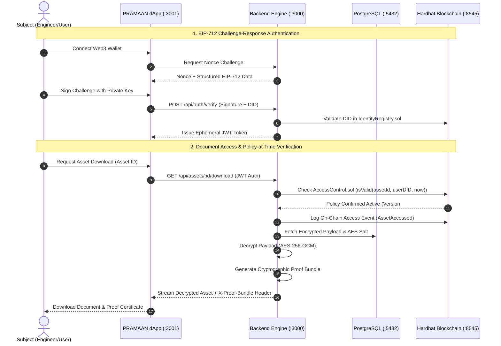

<p align="center">
  
  <br />
  
</p>

<p align="center">
  <strong>Enterprise Zero-Trust Blockchain Access Control, Dynamic RBAC & Cryptographic Temporal Audits</strong>
</p>

<p align="center">
  <em>Developed for Smart India Hackathon (SIH 2026) // Problem Statement 26125</em><br />
  <strong>Organization:</strong> Bharat Electronics Limited (BEL) &bull; Ministry of Defence, Government of India
</p>

<p align="center">
  
  
  
  
  
  
  
</p>

---

## 📑 Table of Contents

- [Executive Summary](#-executive-summary)
- [Problem Statement Context (BEL)](#-problem-statement-context-bel)
- [Core Architectural Innovations](#-core-architectural-innovations)
- [System Architecture & Flow](#-system-architecture--flow)
- [Quick Start: Choose Your Launch Option](#-quick-start-choose-your-launch-option)
  - [Prerequisites](#1-prerequisites)
  - [Database Setup (Docker & Prisma)](#2-database-setup-docker--prisma)
  - [Option A: 1-Command Unified Startup (Recommended)](#option-a-1-command-unified-startup-recommended)
  - [Option B: Manual 4-Terminal Startup](#option-b-manual-4-terminal-startup)
- [Subsystem Guides](#-subsystem-guides)
- [Smart Contracts Architecture](#-smart-contracts-architecture)
- [Cryptographic Security Model](#-cryptographic-security-model)
- [Troubleshooting & FAQ](#-troubleshooting--faq)
- [License & SIH Disclaimer](#-license--sih-disclaimer)

---

## 🏛 Executive Summary

**PRAMAAN** (प्रमाण — *"Proof / Testimony"*) is an immutable, zero-trust digital asset access control and temporal audit platform. Built specifically for high-integrity defence, aerospace, and mission-critical enterprise environments, PRAMAAN eliminates single points of failure in document verification.

Every identity is an on-chain Decentralized Identifier (**DID**). Every sensitive technical manual, maintenance report, or spares authorization order is encrypted off-chain using **AES-256-GCM**, with its cryptographic fingerprint anchored immutably to an EVM blockchain. Access permissions are verified on-chain at block speed, producing verifiable, portable cryptographic proof bundles that any third party (military depot, auditor, or judicial court) can verify completely offline.

---

## 🎯 Problem Statement Context (BEL)

In long-lifecycle defence systems (such as radar arrays, avionics, and naval communication systems manufactured by **Bharat Electronics Limited**) operating across 20–30 year service spans:

1. **The Legacy Vulnerability**: Traditional Role-Based Access Control (RBAC) relies on mutable centralized relational databases. A rogue database administrator or compromised service account can alter access records or forge authorizations retrospectively without leaving a tamper-evident trace.
2. **The Temporal Audit Problem**: Traditional systems only know *current* permissions. If an engineer legitimately accessed classified documentation in 2024, but had their clearance revoked in 2026, standard RBAC answers: *"Access denied."* It cannot mathematically prove whether the 2024 access was lawful under the exact rules active at that precise timestamp.
3. **Air-Gapped & Third-Party Verification**: Military field depots, independent maintenance contractors, and judicial bodies often operate with air-gapped networks. They need a way to verify access legitimacy without connecting to or trusting the vendor's live database.

**PRAMAAN solves all three challenges.**

---

## ⚡ Core Architectural Innovations

### 1. Policy-at-the-Time Temporal Verification
Permissions in PRAMAAN are stored as an append-only, versioned timeline on-chain (`AccessControl.sol`), never a mutable single-row state. When an audit query is performed for any timestamp $T$:
$$\text{Permission}(T) = \text{Policy}_{\text{version}} \quad \text{where} \quad \text{validFrom} \le T \le \text{validUntil} \land \neg\text{revoked}$$
The system mathematically proves whether access was legitimate under the rules that existed at the exact second it occurred.

### 2. Standalone Cryptographic Proof Bundles (`X-Proof-Bundle`)
Every authorized asset download emits a self-contained cryptographic proof package:
- Target Asset Content SHA-256 Fingerprint
- Requester DID & Public Key
- Active Policy Version on-chain at time of access
- Cryptographic signature from the PRAMAAN Protocol Authority
- EVM Block Header & Merkle Inclusion Receipt

*Any auditor holding this bundle can verify its authenticity completely offline via the `/verify` portal without connecting to the PRAMAAN backend.*

---

## 🔄 System Architecture & Flow



---

## 🚀 Quick Start: Choose Your Launch Option

### 1. Prerequisites
- **Node.js**: `v20.x` or `v22.x` (LTS recommended) &bull; `node -v`
- **npm**: `v10.x` or higher &bull; `npm -v`
- **Docker Desktop**: Required to run the PostgreSQL database &bull; [Download Docker](https://www.docker.com/)

---

### 2. Database Setup (Docker & Prisma)

Before launching the servers, start PostgreSQL and run Prisma migrations:

```bash
# 1. Navigate to the backend directory
cd backend

# 2. Start PostgreSQL via Docker Compose
docker compose up -d

# 3. Generate Prisma client & apply database migrations
npx prisma generate
npx prisma migrate dev --name init

# 4. Return to the trustledger directory
cd ..
```

---

### Option A: 1-Command Unified Startup (Recommended)

Run the entire ecosystem with **one single command**:

```bash
npm run start:all
```

*Or on Windows PowerShell:*
```powershell
./start-all.ps1
```

#### What happens behind the scenes:
1. **Database Check**: Verifies PostgreSQL connectivity on port `5432`.
2. **Blockchain EVM**: Spawns `npx hardhat node` on `http://127.0.0.1:8545`.
3. **Automated Contract Deployment**: Compiles and deploys `IdentityRegistry.sol`, `AccessControl.sol`, and `AssetRegistry.sol` in the required dependency order, automatically injecting freshly deployed contract addresses into `backend/.env`.
4. **Backend Engine**: Boots the Express/TypeScript API service strictly on **`http://localhost:3000`**.
5. **Next.js Frontend**: Boots the Next.js 16 Web dApp strictly on **`http://localhost:3001`**.
6. **Graceful Shutdown**: Pressing `Ctrl + C` cleanly terminates all child processes simultaneously with zero leftover zombie ports.

---

### Option B: Manual 4-Terminal Startup

#### Terminal 1: Local Hardhat Blockchain (Port 8545)
```bash
cd contracts
npx hardhat node
```

#### Terminal 2: Contract Deployment & Address Wiring
```bash
cd contracts
npx hardhat run scripts/deploy.js --network localhost
```

#### Terminal 3: PRAMAAN Backend Engine (Port 3000)
```bash
cd backend
npm start
```

#### Terminal 4: PRAMAAN Frontend Web App (Port 3001)
```bash
cd frontend
npm run dev
```

---

## 📦 Subsystem Guides

Each subdirectory has its own dedicated technical documentation:
- 📜 **[contracts/README.md](contracts/README.md)**: Smart contracts specification, testing, and deployment.
- ⚙️ **[backend/README.md](backend/README.md)**: API specification, Prisma models, EIP-712 auth, and proof generation.
- 💻 **[frontend/README.md](frontend/README.md)**: Next.js 16 App Router, responsive themes, and Web3 integration.

---

## 🔒 Smart Contracts Architecture

The contracts are located in `contracts/contracts/` and deploy in strict hierarchy:
```
IdentityRegistry.sol ──> AccessControl.sol ──> AssetRegistry.sol
```

| Contract | Purpose | Core Functions / Events |
| :--- | :--- | :--- |
| **`IdentityRegistry.sol`** | Manages DIDs, roles (`ADMIN`, `MANAGER`, `AUDITOR`, `USER`), and public keys. | `registerIdentity()`, `revokeIdentity()`, `getIdentity()`, `hasRole()` |
| **`AccessControl.sol`** | Enforces versioned temporal RBAC policies and validity timestamps. | `grantAccess()`, `revokeAccess()`, `isValid()`, `getPolicyAtTime()` |
| **`AssetRegistry.sol`** | Immutable register of encrypted document digests and ownership. | `registerAsset()`, `transferAsset()`, `logAccessEvent()`, `getAsset()` |

---

## ❓ Troubleshooting & FAQ

### Port Already in Use (3000 or 3001)
If a process lingers after an abrupt terminal close:
```powershell
netstat -ano | findstr :3000
taskkill /PID <PID> /F
```
*The frontend is strictly locked to port `3001` via `next dev -p 3001` to prevent collisions with the backend.*

### Hardhat Chain Reset
Every local Hardhat node restart resets the chain. When you restart the node, always re-run `npx hardhat run scripts/deploy.js --network localhost` (or run `npm run start:all`), which automatically updates `backend/.env`.

---

## 📜 License & SIH Disclaimer

Built as a submission for **Smart India Hackathon (SIH 2026)** under **Problem Statement 26125** for **Bharat Electronics Limited (BEL)**. Distributed under the MIT License.
