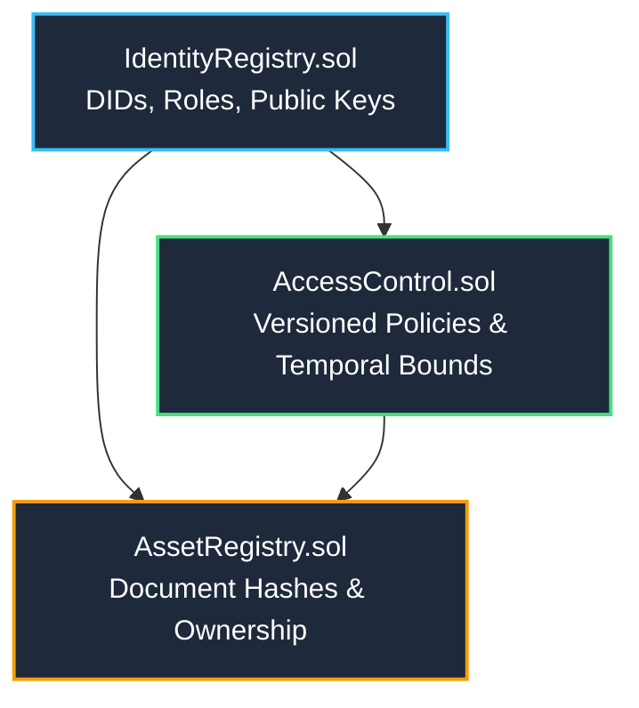

<p align="center">
  
</p>

# 📜 PRAMAAN — Smart Contracts Tier

This module contains the Solidity smart contracts that serve as the single source of truth for **PRAMAAN** (SIH 2026 // PS 26125).

The smart contracts govern Decentralized Identifiers (DIDs), on-chain dynamic Role-Based Access Control (RBAC), immutable document asset digests, and tamper-evident access audit trails.

---

## 🏛 Contract Architecture & Dependency Hierarchy

The contracts adhere to a strict linear dependency order. They **must** be compiled and deployed in this exact sequence:



### 1. `IdentityRegistry.sol`
- **Role Hierarchy**: `ADMIN` (0), `MANAGER` (1), `AUDITOR` (2), `USER` (3).
- **Core State**: Maps Ethereum wallet addresses to unique DIDs (`did:trustledger:<address>`), assigned roles, and public keys.
- **Access Control**: Only callers with the `ADMIN` role can register or revoke identities.

### 2. `AccessControl.sol`
- **Temporal Policy Enforcer**: Enforces permissions bounded by `validFrom` and `validUntil` timestamps.
- **Zero-Overwrite Versioning**: Updating a policy never overwrites historical state; it appends a new revision with monotonic version numbers.
- **Audit Verification (`isValid`)**:
  ```solidity
  function isValid(bytes32 assetId, address subject, uint256 timestamp) external view returns (bool, uint256);
  ```
  Returns whether access was legitimate at the exact second specified, along with the active policy version number.

### 3. `AssetRegistry.sol`
- **Document Anchoring**: Records document SHA-256 digests and IPFS/storage URIs off-chain.
- **Access Logging**: When a granted user downloads an asset, `logAccessEvent()` emits an on-chain event with timestamp and block number, generating an immutable audit trail.

---

## 🛠 Commands & Testing

### 1. Install Dependencies
```bash
npm install
```

### 2. Compile Contracts
```bash
npx hardhat compile
```

### 3. Run Unit Tests
```bash
npx hardhat test
```
*Tests cover identity registration, role validation, policy grant/revocation, expired policy rejection, and unauthorized asset access attempts.*

---

## 🚀 Local Deployment

### Step 1: Start Hardhat Node
```bash
npx hardhat node
```
*Hosts a local EVM node on `http://127.0.0.1:8545` with 20 pre-funded test accounts.*

### Step 2: Deploy Contracts
```bash
npx hardhat run scripts/deploy.js --network localhost
```

> [!NOTE]
> The deployment script (`scripts/deploy.js`) automatically writes freshly generated contract addresses directly into `../backend/.env`. You do not need to copy and paste contract addresses manually.
