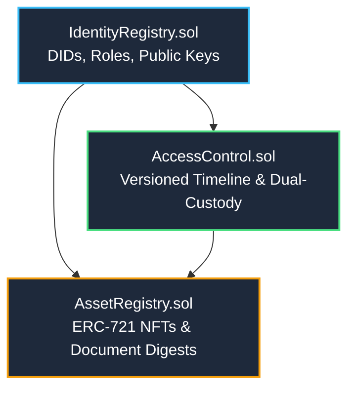

<p align="center">
  
</p>

# 📜 PRAMAAN — Smart Contracts Tier

This module contains the Solidity smart contracts that serve as the cryptographic single source of truth for **PRAMAAN** (SIH 2026 // PS 26125).

The smart contracts govern Decentralized Identifiers (DIDs), on-chain dynamic Role-Based Access Control (RBAC), append-only temporal permission versioning, dual-custody multi-officer authorization, immutable document digests (ERC-721), and tamper-evident access audit trails.

---

## 🏛 Contract Architecture & Dependency Hierarchy

The contracts adhere to a strict linear dependency order. They are compiled with Solidity `0.8.24` targeting EVM `cancun` (for `mcopy` support via OpenZeppelin v5) and deployed in this sequence:


```mermaid
graph TD
    A[IdentityRegistry.sol<br/>DIDs, Roles, Public Keys] --> B[AccessControl.sol<br/>Versioned Timeline & Dual-Custody]
    A --> C[AssetRegistry.sol<br/>ERC-721 NFTs & Document Digests]
    B --> C
    
    style A fill:#1e293b,stroke:#38bdf8,stroke-width:2px,color:#fff
    style B fill:#1e293b,stroke:#4ade80,stroke-width:2px,color:#fff
    style C fill:#1e293b,stroke:#f59e0b,stroke-width:2px,color:#fff
```

### 1. `IdentityRegistry.sol`
- **Role Hierarchy**: `NONE` (0), `ADMIN` (1), `MANAGER` (2), `AUDITOR` (3), `USER` (4).
- **Status Enum**: `ACTIVE` (0), `REVOKED` (1).
- **Canonical Resolver**: Maps Ethereum wallet addresses to unique DIDs (`did:trustledger:<address>`), assigned roles, public keys, and status.
- **Core Operations**:
  - `registerIdentity(address, string did, bytes publicKey, Role)`: Admin-only registration of new identities.
  - `revokeIdentity(address)`: Admin-only revocation. Preserves historical record and DID mapping for historical audit queries.
  - `resolveDID(string did) returns (address)`: Canonical DID ↔ address resolver.
  - `isActive(address) returns (bool)`: Real-time status guard.
  - `getRole(address) returns (Role)`: Returns role or `Role.NONE` for unregistered addresses.

### 2. `AccessControl.sol` (Core USP: Temporal State Engine & Dual-Custody)
- **Zero-Overwrite Versioning**: Updating a policy never overwrites historical state; it appends a new revision with `[validFrom, validUntil)` bounds.
- **Policy-at-the-Time Verification**:
  ```solidity
  function checkPermissionAtTime(
      uint256 assetId,
      string calldata subjectDID,
      Action action,
      uint256 atTimestamp
  ) external view returns (Permission memory);
  ```
  Returns the exact permission state that existed at any second in history.
- **Real-Time Access Guard**:
  ```solidity
  function checkPermissionNow(
      uint256 assetId,
      string calldata subjectDID,
      Action action
  ) external view returns (bool);
  ```
  Enforces that permission is `GRANTED` AND the subject's identity is currently `ACTIVE`.
- **Tamper-Evident Access Logging**:
  ```solidity
  function recordAccess(
      uint256 assetId,
      string calldata requesterDID,
      uint256 permissionId
  ) external;
  ```
  Independently re-verifies caller authorization on-chain before emitting `AssetAccessed`.
- **Dual-Custody Multi-Officer Authorization (Two-Man Rule)**:
  - For `CONFIDENTIAL` assets, single-sig grants are prohibited.
  - `requestPermission(...)`: Officer 1 (Maker) creates a `PENDING` request with a deterministic 24-hour TTL (`expiresAt`).
  - `approvePermission(uint256 requestId)`: Officer 2 (Checker) verifies authorization. Strictly enforces `msg.sender != request.requester` (non-self-approval) and TTL validity before appending to the versioned timeline.
  - `cancelPermissionRequest(uint256 requestId)`: Original requester or active Admin can cancel pending requests.
  - `setAssetRegistry(address)`: One-shot deployer initializer linking `AssetRegistry` for asset classification lookup.

### 3. `AssetRegistry.sol`
- **ERC-721 Asset Records**: Each asset is minted as an ERC-721 token representing cryptographic ownership.
- **Classification Levels**: `PUBLIC` (0), `INTERNAL` (1), `CONFIDENTIAL` (2).
- **Core Operations**:
  - `registerAsset(bytes32 assetHash, string ownerDID, string metadataURI, Classification)`: Mints token to owner's resolved address and anchors the document SHA-256 digest.
  - `transferAsset(uint256 assetId, address to)`: Synchronizes token ownership and `ownerDID`, gating transfers through `AccessControl` `TRANSFER` permissions.
  - `updateAssetVersion(uint256 assetId, bytes32 newAssetHash, string newMetadataURI)`: Updates version and digest while preserving ownership and historical token ID.

---

## 🛠 Commands & Testing

### 1. Install Dependencies
```bash
npm install
```

### 2. Compile Contracts
```bash
npx hardhat compile
```

### 3. Run Unit & Invariant Test Suite
```bash
npx hardhat test
```

**Test Coverage Summary (68 passing tests):**
- `IdentityRegistry.test.js` (20 tests): Bootstrap admin, registration invariants, revocation immutability, DID canonical resolution.
- `AccessControl.test.js` (31 tests): Versioning bounds, `checkPermissionAtTime` historical verification, TOCTOU defense, `recordAccess` caller authorization, and complete dual-custody lifecycle (maker-checker separation, non-self-approval, 24h TTL, cancellation).
- `AssetRegistry.test.js` (17 tests): Token minting, transfer authorization consistency, versioning updates, classification bounds.

---

## 🚀 Local Deployment

### Step 1: Start Hardhat Node
```bash
npx hardhat node
```
*Hosts a local EVM node on `http://127.0.0.1:8545` with 20 pre-funded test accounts.*

### Step 2: Deploy Contracts
```bash
npx hardhat run scripts/deploy.js --network localhost
```

> [!NOTE]
> The deployment script (`scripts/deploy.js`) automatically deploys `IdentityRegistry`, `AccessControl`, and `AssetRegistry`, executes the one-shot `setAssetRegistry` link, and writes generated contract addresses directly into `../backend/.env`.
