# 🏛 PRAMAAN — Architecture & Flow Specification

<p align="center">
  
  <br />
  
</p>

<p align="center">
  <strong>Enterprise Zero-Trust Blockchain Access Control, Dynamic RBAC & Cryptographic Temporal Audits</strong><br/>
  <em>Smart India Hackathon (SIH 2026) | Problem Statement 26125 | Bharat Electronics Limited (BEL)</em>
</p>

<p align="center">
  
  
  
  
  
  
</p>

---

## 📑 Interactive Table of Contents

- [⚡ 0. The Core Mental Model (In 60 Seconds)](#-0-the-core-mental-model-in-60-seconds)
- [🔷 PART 1: High-Level Overview (Names & Headings Only)](#-part-1-high-level-overview-names--headings-only)
  - [1.1 Minimal System Architecture](#11-minimal-system-architecture)
  - [1.2 High-Level Lifecycle Flow](#12-high-level-lifecycle-flow)
- [🔶 PART 2: Comprehensive & In-Depth Architecture & Flows](#-part-2-comprehensive--in-depth-architecture--flows)
  - [2.1 Detailed System Architecture Blueprint](#21-detailed-system-architecture-blueprint)
  - [2.2 Detailed Workflow Sequences & Inspectors](#22-detailed-workflow-sequences--inspectors)
    - [Flow 1: Challenge-Response Authentication (EIP-191/712)](#flow-1-challenge-response-authentication-eip-191712)
    - [Flow 2: Zero-Trust Asset Ingestion & Envelope Encryption](#flow-2-zero-trust-asset-ingestion--envelope-encryption)
    - [Flow 3: Versioned Policy Management (Dynamic RBAC)](#flow-3-versioned-policy-management-dynamic-rbac)
    - [Flow 4: Verified Asset Download & Proof Bundle Generation](#flow-4-verified-asset-download--proof-bundle-generation)
    - [Flow 5: Temporal Policy-at-the-Time Verification (Auditor Flow)](#flow-5-temporal-policy-at-the-time-verification-auditor-flow)
    - [Flow 6: Independent Third-Party Proof Verification (Level 2)](#flow-6-independent-third-party-proof-verification-level-2)
    - [Flow 7: Dual-Custody Multi-Officer Authorization (Two-Man Rule)](#flow-7-dual-custody-multi-officer-authorization-two-man-rule)
  - [2.3 Cryptographic Key Hierarchy & Security Boundary](#23-cryptographic-key-hierarchy--security-boundary)
  - [2.4 Smart Contracts Reference Matrix](#24-smart-contracts-reference-matrix)
  - [2.5 Port Allocation & Runtime Network Summary](#25-port-allocation--runtime-network-summary)
  - [2.6 Live Inspection & Debugging Handbook](#26-live-inspection--debugging-handbook)

---

## ⚡ 0. The Core Mental Model (In 60 Seconds)

Traditional Role-Based Access Control (RBAC) relies on **mutable centralized databases** (`UPDATE users SET role = 'USER'`). If an aerospace or radar maintenance engineer accessed classified telemetry in 2024, but had their clearance revoked in 2026, standard RBAC fails:
- It only knows the **current state** ("Access Denied").
- It cannot prove whether the 2024 access was lawful under the rules active at that precise second.
- A database administrator or attacker can alter past audit logs without detection.

### The PRAMAAN Solution

```
┌────────────────────────────────────────────────────────────────────────────────────────┐
│                                 THE 3 PILLARS OF PRAMAAN                               │
├──────────────────────────┬─────────────────────────────┬───────────────────────────────┤
│ 1. ON-CHAIN TIMELINES    │ 2. DUAL-TIER ENVELOPE       │ 3. STANDALONE PROOF BUNDLES   │
│ Permissions are stored   │ Payloads are encrypted with │ Downloads emit a cryptograph- │
│ as append-only versioned │ unique per-asset AES keys.  │ ically signed JSON bundle.    │
│ arrays. Valid ranges     │ Master keys wrap asset keys.│ External auditors verify it   │
│ [validFrom, validUntil)  │ Zero unencrypted bytes      │ independently via EVM RPC     │
│ are mathematically fixed.│ ever touch the blockchain.  │ without trusting our backend. │
└──────────────────────────┴─────────────────────────────┴───────────────────────────────┘
```

$$\text{Permission}(T) = \text{Policy}_k \quad \iff \quad \text{validFrom}_k \le T < \text{validUntil}_k \quad \land \quad \text{state} = \text{GRANTED}$$

---

# 🔷 PART 1: High-Level Overview (Names & Headings Only)

### 1.1 Minimal System Architecture

<p align="center">
  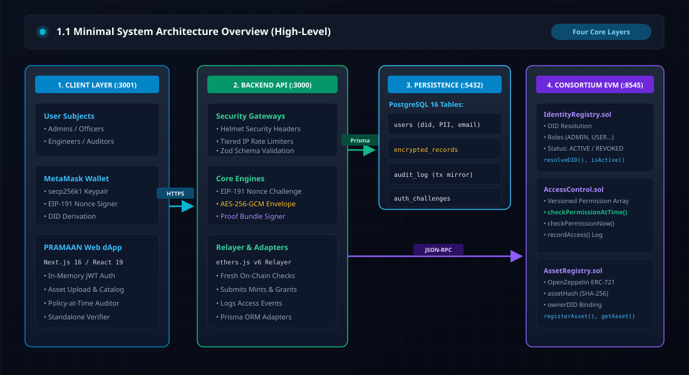
</p>

<details>
<summary><b>🔍 Click to expand Raw Architecture Graph Definition</b></summary>

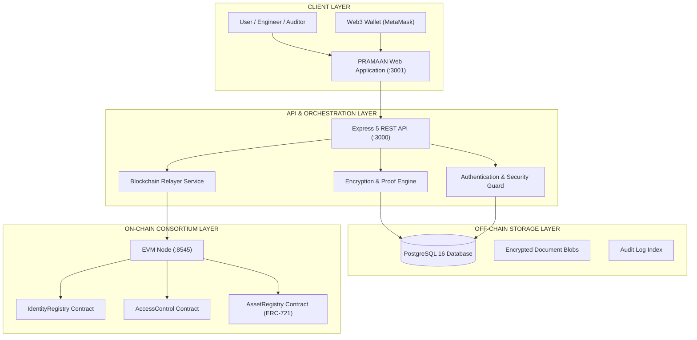
```mermaid
graph TD
    subgraph Client["CLIENT LAYER"]
        User["User / Engineer / Auditor"]
        Wallet["Web3 Wallet (MetaMask)"]
        UI["PRAMAAN Web Application (:3001)"]
    end

    subgraph Backend["API & ORCHESTRATION LAYER"]
        Gateway["Express 5 REST API (:3000)"]
        AuthModule["Authentication & Security Guard"]
        CryptoEngine["Encryption & Proof Engine"]
        Relayer["Blockchain Relayer Service"]
    end

    subgraph Storage["OFF-CHAIN STORAGE LAYER"]
        Postgres[("PostgreSQL 16 Database")]
        Records["Encrypted Document Blobs"]
        AuditMirror["Audit Log Index"]
    end

    subgraph Blockchain["ON-CHAIN CONSORTIUM LAYER"]
        EVM["EVM Node (:8545)"]
        IdentityReg["IdentityRegistry Contract"]
        AccessCtrl["AccessControl Contract"]
        AssetReg["AssetRegistry Contract (ERC-721)"]
    end

    User --> UI
    Wallet --> UI
    UI --> Gateway
    Gateway --> AuthModule
    Gateway --> CryptoEngine
    Gateway --> Relayer
    CryptoEngine --> Postgres
    AuthModule --> Postgres
    Relayer --> EVM
    EVM --> IdentityReg
    EVM --> AccessCtrl
    EVM --> AssetReg
```
</details>

---

### 1.2 High-Level Lifecycle Flow

<p align="center">
  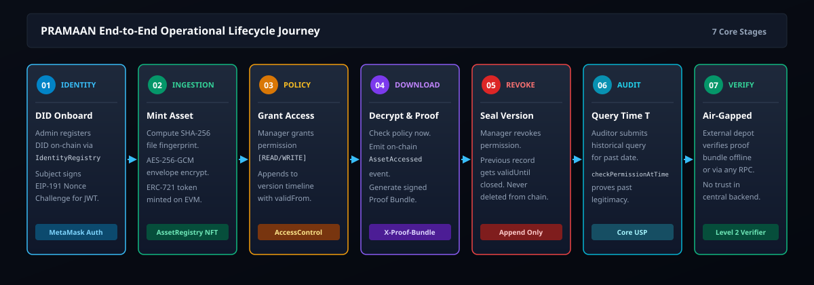
</p>

| Step | Heading | Core Function |
| :--- | :--- | :--- |
| **01** | **DID Onboarding** | Admin registers identity with assigned role on-chain; user signs in via wallet challenge. |
| **02** | **Asset Registration** | Document is hashed (SHA-256), encrypted (AES-256-GCM), and minted as an ERC-721 NFT. |
| **03** | **Policy Grant** | Admin or Manager assigns timestamp-bounded access permissions to user DIDs. |
| **04** | **Verified Download** | On-chain policy is validated at block speed; document decrypts & emits signed proof bundle. |
| **05** | **Policy Revocation** | Access is revoked; previous version is sealed with an end-timestamp without deleting history. |
| **06** | **Temporal Audit** | Auditor queries historical access legitimacy at any exact past second $T$. |
| **07** | **Proof Verification** | External airbases or third parties verify cryptographic proof bundles against chain state. |

---

# 🔶 PART 2: Comprehensive & In-Depth Architecture & Flows

### 2.1 Detailed System Architecture Blueprint

This diagram illustrates the concrete separation of concerns across presentation, orchestration, database, and consensus layers:

<p align="center">
  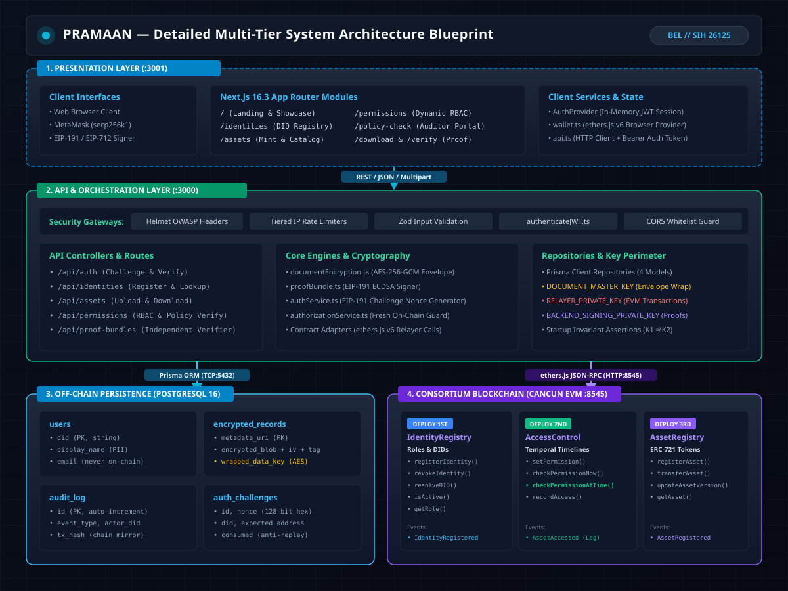
</p>

<details>
<summary><b>🔍 Click to expand Raw Architecture Graph Definition</b></summary>

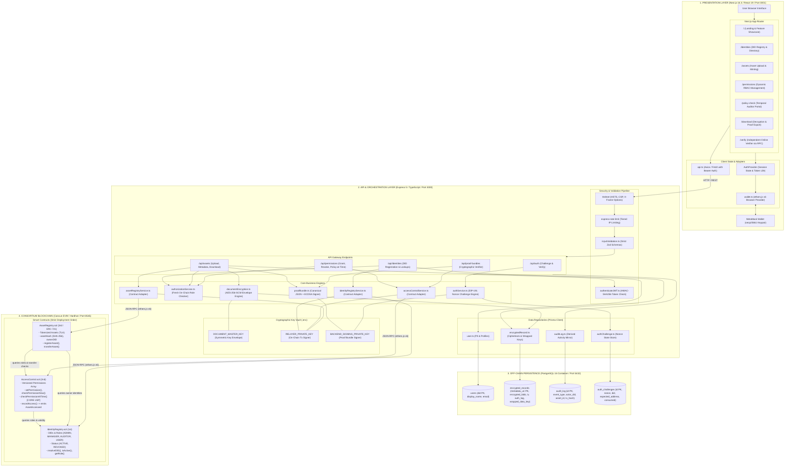
```mermaid
graph TB
    subgraph ClientTier["1. PRESENTATION LAYER (Next.js 16.3 / React 19 / Port 3001)"]
        direction TB
        Browser["User Browser Interface"]
        MetaMask["MetaMask Wallet (secp256k1 Keypair)"]
        
        subgraph AppRouter["Next.js App Router"]
            P_Home["/ (Landing & Feature Showcase)"]
            P_Identities["/identities (DID Registry & Directory)"]
            P_Assets["/assets (Asset Upload & Minting)"]
            P_Permissions["/permissions (Dynamic RBAC Management)"]
            P_PolicyCheck["/policy-check (Temporal Auditor Portal)"]
            P_Download["/download (Decryption & Proof Export)"]
            P_Verify["/verify (Independent Online Verifier via RPC)"]
        end

        subgraph ClientContext["Client State & Adapters"]
            AuthCtx["AuthProvider (Session State & Token Life)"]
            WalletLib["wallet.ts (ethers.js v6 Browser Provider)"]
            ApiClient["api.ts (Axios / Fetch with Bearer Auth)"]
        end

        Browser --> AppRouter
        AppRouter --> AuthCtx
        AppRouter --> ApiClient
        AuthCtx --> WalletLib
        WalletLib <--> MetaMask
    end

    subgraph BackendTier["2. API & ORCHESTRATION LAYER (Express 5 / TypeScript / Port 3000)"]
        direction TB
        
        subgraph Middlewares["Security & Validation Pipeline"]
            SecHeaders["Helmet (HSTS, CSP, X-Frame-Options)"]
            RateLimit["express-rate-limit (Tiered IP Limiting)"]
            ZodValid["inputValidation.ts (Strict Zod Schemas)"]
            JwtAuth["authenticateJWT.ts (HMAC-SHA256 Token Check)"]
        end

        subgraph Routes["API Gateway Endpoints"]
            R_Auth["/api/auth (Challenge & Verify)"]
            R_Identities["/api/identities (DID Registration & Lookups)"]
            R_Assets["/api/assets (Upload, Metadata, Download)"]
            R_Permissions["/api/permissions (Grant, Revoke, Policy-at-Time)"]
            R_Proof["/api/proof-bundles (Cryptographic Verifier)"]
        end

        subgraph Services["Core Business Engines"]
            S_Auth["authService.ts (EIP-191 Nonce Challenge Engine)"]
            S_AuthZ["authorizationService.ts (Fresh On-Chain Role Checker)"]
            S_Crypto["documentEncryption.ts (AES-256-GCM Envelope Engine)"]
            S_Proof["proofBundle.ts (Canonical JSON + ECDSA Signer)"]
            S_Identity["identityRegistryService.ts (Contract Adapter)"]
            S_Access["accessControlService.ts (Contract Adapter)"]
            S_Asset["assetRegistryService.ts (Contract Adapter)"]
        end

        subgraph Repositories["Data Repositories (Prisma Client)"]
            Repo_User["user.ts (PII & Profiles)"]
            Repo_Record["encryptedRecord.ts (Ciphertexts & Wrapped Keys)"]
            Repo_Audit["auditLog.ts (Derived Activity Mirror)"]
            Repo_Challenge["authChallenge.ts (Nonce State Store)"]
        end

        subgraph KeyVault["Cryptographic Key Vault (.env)"]
            K_Master["DOCUMENT_MASTER_KEY (Symmetric Key Envelope)"]
            K_Relayer["RELAYER_PRIVATE_KEY (On-Chain Tx Signer)"]
            K_Signer["BACKEND_SIGNING_PRIVATE_KEY (Proof Bundle Signer)"]
        end

        ApiClient -->|"HTTP / REST"| SecHeaders
        SecHeaders --> RateLimit
        RateLimit --> ZodValid
        ZodValid --> Routes
        Routes --> JwtAuth
        
        R_Auth --> S_Auth
        R_Identities --> S_AuthZ & S_Identity & Repo_User
        R_Assets --> S_AuthZ & S_Crypto & S_Asset & Repo_Record & S_Proof
        R_Permissions --> S_AuthZ & S_Access
        R_Proof --> S_Proof & S_Access

        S_Crypto --- K_Master
        S_Identity & S_Access & S_Asset --- K_Relayer
        S_Proof & S_Auth --- K_Signer
        
        S_Auth --> Repo_Challenge
        S_Crypto --> Repo_Record
        Routes --> Repo_Audit
    end

    subgraph DataTier["3. OFF-CHAIN PERSISTENCE (PostgreSQL 16 Container / Port 5432)"]
        direction TB
        DB_Users[("users (did PK, display_name, email)")]
        DB_Records[("encrypted_records (metadata_uri PK, encrypted_blob, iv, auth_tag, wrapped_data_key)")]
        DB_Audit[("audit_log (id PK, event_type, actor_did, asset_id, tx_hash)")]
        DB_Challenges[("auth_challenges (id PK, nonce, did, expected_address, consumed)")]

        Repo_User --> DB_Users
        Repo_Record --> DB_Records
        Repo_Audit --> DB_Audit
        Repo_Challenge --> DB_Challenges
    end

    subgraph BlockchainTier["4. CONSORTIUM BLOCKCHAIN (Cancun EVM / Hardhat / Port 8545)"]
        direction TB
        
        subgraph Contracts["Smart Contracts (Strict Deployment Order)"]
            C_Identity["IdentityRegistry.sol (1st)<br/>- DIDs & Roles (ADMIN, MANAGER, AUDITOR, USER)<br/>- Status (ACTIVE, REVOKED)<br/>- resolveDID(), isActive(), getRole()"]
            C_Access["AccessControl.sol (2nd)<br/>- Versioned Permissions Array<br/>- setPermission(), checkPermissionNow()<br/>- checkPermissionAtTime() [CORE USP]<br/>- recordAccess() -> emits AssetAccessed"]
            C_Asset["AssetRegistry.sol (3rd / ERC-721)<br/>- Tokenized Assets (TLA)<br/>- assetHash (SHA-256), ownerDID<br/>- registerAsset(), transferAsset()"]
        end

        C_Access -->|"queries roles & validity"| C_Identity
        C_Asset -->|"queries roles & transfer checks"| C_Access
        C_Asset -->|"queries owner identities"| C_Identity

        S_Identity -->|"JSON-RPC (ethers.js v6)"| C_Identity
        S_Access -->|"JSON-RPC (ethers.js v6)"| C_Access
        S_Asset -->|"JSON-RPC (ethers.js v6)"| C_Asset
    end
```
</details>

---

### 2.2 Detailed Workflow Sequences & Inspectors

#### Flow 1: Challenge-Response Authentication (EIP-191/712)
No passwords, no database password hashes. Authentication is mathematically proven via elliptic curve signatures (`secp256k1`).

<p align="center">
  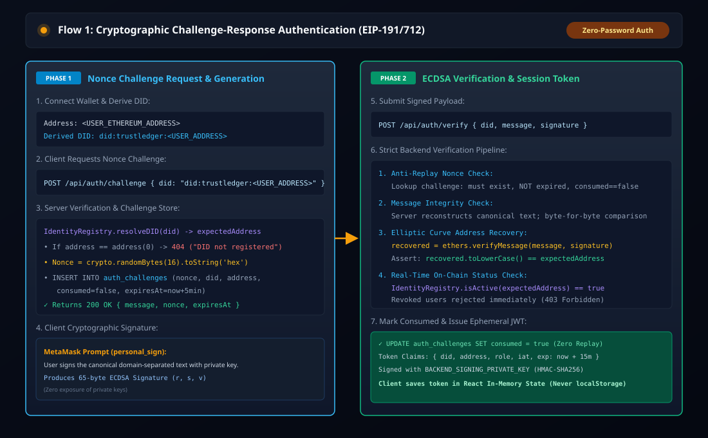
</p>

<details>
<summary><b>🔍 Click to expand Raw Authentication Sequence Protocol</b></summary>

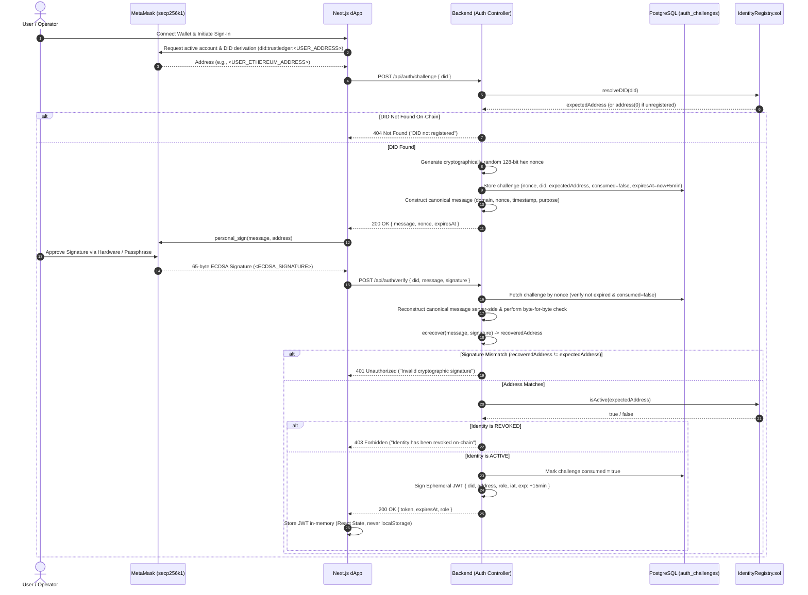
```mermaid
sequenceDiagram
    autonumber
    actor User as User / Operator
    participant Wallet as MetaMask (secp256k1)
    participant UI as Next.js dApp
    participant API as Backend (Auth Controller)
    participant DB as PostgreSQL (auth_challenges)
    participant IR as IdentityRegistry.sol

    User->>UI: Connect Wallet & Initiate Sign-In
    UI->>Wallet: Request active account & DID derivation (did:trustledger:<USER_ADDRESS>)
    Wallet-->>UI: Address (e.g., <USER_ETHEREUM_ADDRESS>)
    UI->>API: POST /api/auth/challenge { did }
    API->>IR: resolveDID(did)
    IR-->>API: expectedAddress (or address(0) if unregistered)
    
    alt DID Not Found On-Chain
        API-->>UI: 404 Not Found ("DID not registered")
    else DID Found
        API->>API: Generate cryptographically random 128-bit hex nonce
        API->>DB: Store challenge (nonce, did, expectedAddress, consumed=false, expiresAt=now+5min)
        API->>API: Construct canonical message (domain, nonce, timestamp, purpose)
        API-->>UI: 200 OK { message, nonce, expiresAt }
        
        UI->>Wallet: personal_sign(message, address)
        User->>Wallet: Approve Signature via Hardware / Passphrase
        Wallet-->>UI: 65-byte ECDSA Signature (<ECDSA_SIGNATURE>)
        
        UI->>API: POST /api/auth/verify { did, message, signature }
        API->>DB: Fetch challenge by nonce (verify not expired & consumed=false)
        API->>API: Reconstruct canonical message server-side & perform byte-for-byte check
        API->>API: ecrecover(message, signature) -> recoveredAddress
        
        alt Signature Mismatch (recoveredAddress != expectedAddress)
            API-->>UI: 401 Unauthorized ("Invalid cryptographic signature")
        else Address Matches
            API->>IR: isActive(expectedAddress)
            IR-->>API: true / false
            alt Identity is REVOKED
                API-->>UI: 403 Forbidden ("Identity has been revoked on-chain")
            else Identity is ACTIVE
                API->>DB: Mark challenge consumed = true
                API->>API: Sign Ephemeral JWT { did, address, role, iat, exp: +15min }
                API-->>UI: 200 OK { token, expiresAt, role }
                UI->>UI: Store JWT in-memory (React State, never localStorage)
            end
        end
    end
```
</details>

<details>
<summary><b>🔍 Expand to inspect Challenge Message & JWT Claims</b></summary>

#### Canonical Signable Message (Domain Separated)
```text
PRAMAAN Authentication Request

Domain: trustledger.local
Purpose: Authenticate to PRAMAAN backend
DID: did:trustledger:<USER_ETHEREUM_ADDRESS>
Nonce: <128_BIT_RANDOM_HEX_NONCE>
Issued At: 2026-09-27T10:00:00.000Z
Expiration: 2026-09-27T10:05:00.000Z
```

#### Ephemeral JWT Payload Structure
```json
{
  "did": "did:trustledger:<USER_ETHEREUM_ADDRESS>",
  "address": "<USER_ETHEREUM_ADDRESS>",
  "role": "ADMIN",
  "iat": 1790503200,
  "exp": 1790504100
}
```
> [!NOTE]
> The JWT token is strictly kept in **React in-memory state** on the frontend. It is intentionally **never** persisted to `localStorage` or `sessionStorage` to mitigate Cross-Site Scripting (XSS) token extraction.
</details>

---

#### Flow 2: Zero-Trust Asset Ingestion & Envelope Encryption
Ensures classified technical manuals or defence schematics are completely secure. The blockchain only receives the cryptographic fingerprint.

<p align="center">
  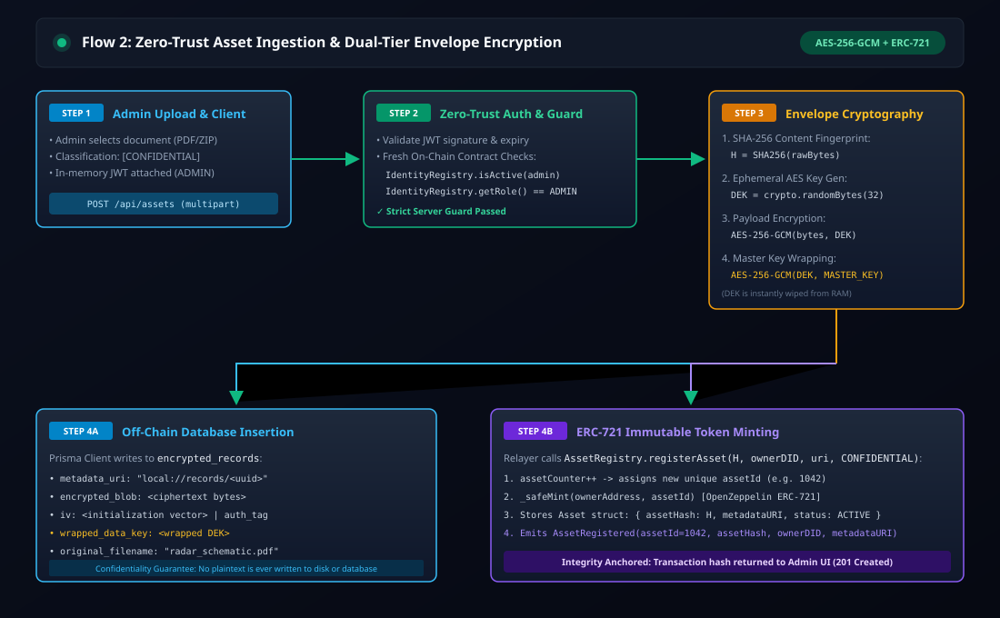
</p>

<details>
<summary><b>🔍 Click to expand Raw Ingestion Sequence Protocol</b></summary>

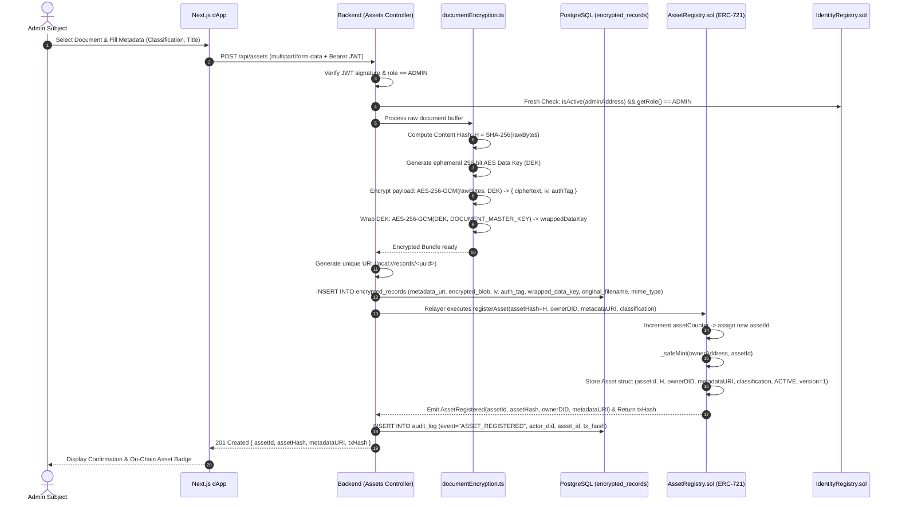
```mermaid
sequenceDiagram
    autonumber
    actor Admin as Admin Subject
    participant UI as Next.js dApp
    participant API as Backend (Assets Controller)
    participant Crypto as documentEncryption.ts
    participant DB as PostgreSQL (encrypted_records)
    participant AR as AssetRegistry.sol (ERC-721)
    participant IR as IdentityRegistry.sol

    Admin->>UI: Select Document & Fill Metadata (Classification, Title)
    UI->>API: POST /api/assets (multipart/form-data + Bearer JWT)
    API->>API: Verify JWT signature & role == ADMIN
    API->>IR: Fresh Check: isActive(adminAddress) && getRole() == ADMIN
    
    API->>Crypto: Process raw document buffer
    Crypto->>Crypto: Compute Content Hash: H = SHA-256(rawBytes)
    Crypto->>Crypto: Generate ephemeral 256-bit AES Data Key (DEK)
    Crypto->>Crypto: Encrypt payload: AES-256-GCM(rawBytes, DEK) -> { ciphertext, iv, authTag }
    Crypto->>Crypto: Wrap DEK: AES-256-GCM(DEK, DOCUMENT_MASTER_KEY) -> wrappedDataKey
    
    Crypto-->>API: Encrypted Bundle ready
    API->>API: Generate unique URI (local://records/<uuid>)
    API->>DB: INSERT INTO encrypted_records (metadata_uri, encrypted_blob, iv, auth_tag, wrapped_data_key, original_filename, mime_type)
    
    API->>AR: Relayer executes registerAsset(assetHash=H, ownerDID, metadataURI, classification)
    AR->>AR: Increment assetCounter -> assign new assetId
    AR->>AR: _safeMint(ownerAddress, assetId)
    AR->>AR: Store Asset struct (assetId, H, ownerDID, metadataURI, classification, ACTIVE, version=1)
    AR-->>API: Emit AssetRegistered(assetId, assetHash, ownerDID, metadataURI) & Return txHash
    
    API->>DB: INSERT INTO audit_log (event="ASSET_REGISTERED", actor_did, asset_id, tx_hash)
    API-->>UI: 201 Created { assetId, assetHash, metadataURI, txHash }
    UI-->>Admin: Display Confirmation & On-Chain Asset Badge
```
</details>

<details>
<summary><b>🔍 Expand to inspect Envelope Encryption Math & Database Record</b></summary>

#### Envelope Key Hierarchy
```
                   DOCUMENT_MASTER_KEY (Server Env Var, 256-bit Hex)
                                    │
                             wraps (AES-256-GCM)
                                    │
                                    ▼
                   PER-ASSET DATA ENCRYPTION KEY (DEK)
                       (Generated randomly per file)
                                    │
                            encrypts (AES-256-GCM)
                                    │
                                    ▼
                          RAW FILE BYTES (PDF/ZIP)
```

#### Stored PostgreSQL Record (`encrypted_records` table)
```json
{
  "metadata_uri": "local://records/9b1deb4d-3b7d-4bad-9bdd-2b0d7b3dcb6d",
  "asset_id": "1042",
  "encrypted_blob": "\\x4f8b91a7c3...",
  "iv": "\\xd291f0c3a812e4b7",
  "auth_tag": "\\x9a10fc438e129b01ca7d",
  "wrapped_data_key": "\\x1908abf24c7e...",
  "original_filename": "radar_maintenance_manual.pdf",
  "mime_type": "application/pdf"
}
```
</details>

---

#### Flow 3: Versioned Policy Management (Dynamic RBAC)
Permissions are never modified in-place or deleted. Each grant or revocation is an immutable append to the on-chain history.

<p align="center">
  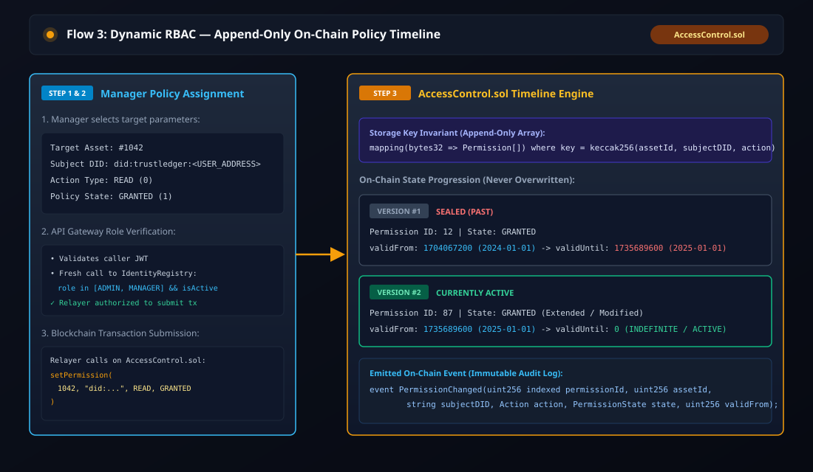
</p>

<details>
<summary><b>🔍 Click to expand Raw Policy Sequence Protocol</b></summary>

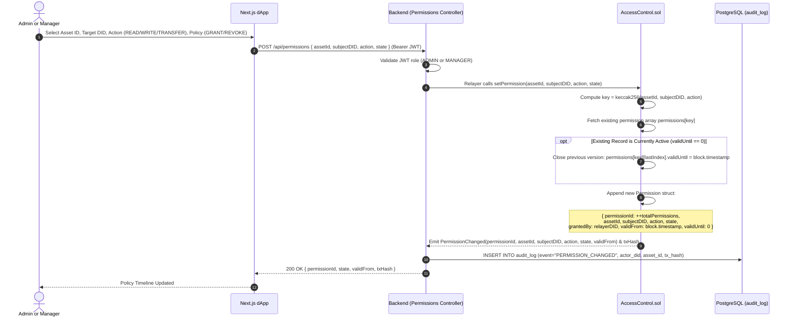
```mermaid
sequenceDiagram
    autonumber
    actor Mgr as Admin or Manager
    participant UI as Next.js dApp
    participant API as Backend (Permissions Controller)
    participant ACC as AccessControl.sol
    participant DB as PostgreSQL (audit_log)

    Mgr->>UI: Select Asset ID, Target DID, Action (READ/WRITE/TRANSFER), Policy (GRANT/REVOKE)
    UI->>API: POST /api/permissions { assetId, subjectDID, action, state } (Bearer JWT)
    API->>API: Validate JWT role (ADMIN or MANAGER)
    API->>ACC: Relayer calls setPermission(assetId, subjectDID, action, state)
    
    ACC->>ACC: Compute key = keccak256(assetId, subjectDID, action)
    ACC->>ACC: Fetch existing permission array permissions[key]
    
    opt Existing Record is Currently Active (validUntil == 0)
        ACC->>ACC: Close previous version: permissions[key][lastIndex].validUntil = block.timestamp
    end
    
    ACC->>ACC: Append new Permission struct:
    Note over ACC: { permissionId: ++totalPermissions,<br/>assetId, subjectDID, action, state,<br/>grantedBy: relayerDID, validFrom: block.timestamp, validUntil: 0 }
    
    ACC-->>API: Emit PermissionChanged(permissionId, assetId, subjectDID, action, state, validFrom) & txHash
    API->>DB: INSERT INTO audit_log (event="PERMISSION_CHANGED", actor_did, asset_id, tx_hash)
    API-->>UI: 200 OK { permissionId, state, validFrom, txHash }
    UI-->>Mgr: Policy Timeline Updated
```
</details>

<details>
<summary><b>🔍 Expand to inspect Solidity Storage Mapping & Struct Layout</b></summary>

#### Storage Structure in `AccessControl.sol`
```solidity
enum Action { READ, WRITE, TRANSFER }
enum PermissionState { REVOKED, GRANTED }

struct Permission {
    uint256 permissionId;   // Unique auto-incrementing ID
    uint256 assetId;        // Target asset token ID
    string subjectDID;      // Target DID string
    Action action;          // READ (0), WRITE (1), TRANSFER (2)
    PermissionState state;  // REVOKED (0), GRANTED (1)
    string grantedBy;       // Authorizing DID
    uint256 validFrom;      // Start timestamp
    uint256 validUntil;     // End timestamp (0 if currently active)
}

// Append-only timeline keyed by hash:
mapping(bytes32 => Permission[]) private _permissions;
```
</details>

---

#### Flow 4: Verified Asset Download & Proof Bundle Generation
The download endpoint combines on-chain gatekeeping, off-chain decryption, audit log anchoring, and portable cryptographic proof generation.

<p align="center">
  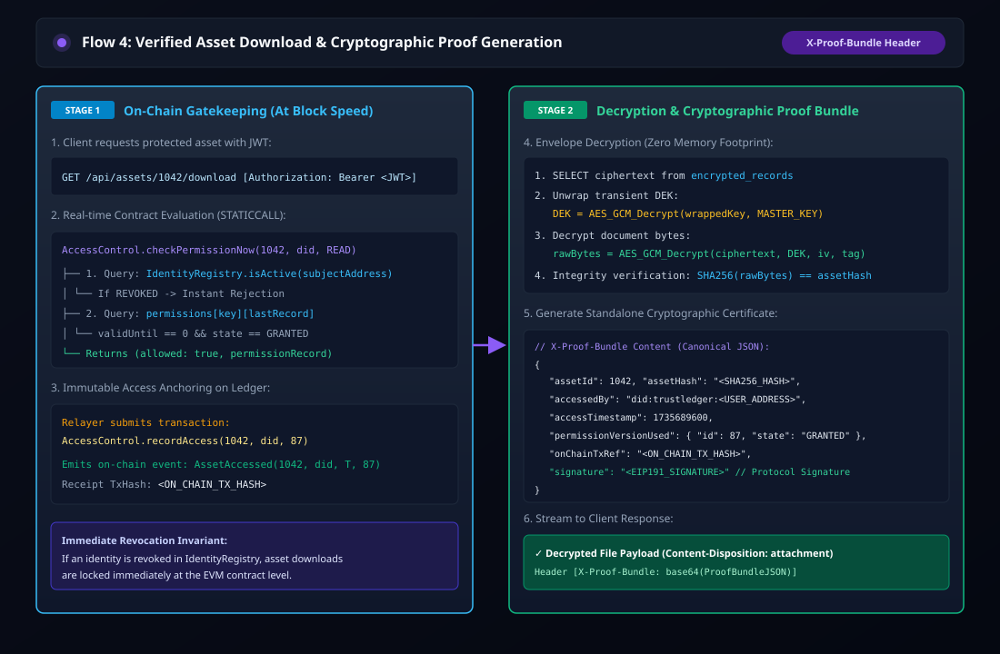
</p>

<details>
<summary><b>🔍 Click to expand Raw Download Sequence Protocol</b></summary>

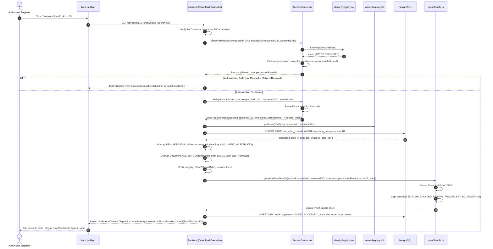
```mermaid
sequenceDiagram
    autonumber
    actor User as Authorized Engineer
    participant UI as Next.js dApp
    participant API as Backend (Download Controller)
    participant ACC as AccessControl.sol
    participant IR as IdentityRegistry.sol
    participant AR as AssetRegistry.sol
    participant DB as PostgreSQL
    participant Proof as proofBundle.ts

    User->>UI: Click "Download Asset" (Asset ID #1042)
    UI->>API: GET /api/assets/1042/download (Bearer JWT)
    API->>API: Verify JWT -> extract requester DID & address
    
    API->>ACC: checkPermissionNow(assetId=1042, subjectDID=requesterDID, action=READ)
    ACC->>IR: isActive(subjectAddress)
    IR-->>ACC: status (ACTIVE / REVOKED)
    ACC->>ACC: Evaluate permissions array for latest record where validUntil == 0
    ACC-->>API: Returns (allowed: true, permissionRecord)
    
    alt Authorization Fails (Not Granted or Subject Revoked)
        API-->>UI: 403 Forbidden ("On-chain access policy denied for current timestamp")
    else Authorization Confirmed
        API->>ACC: Relayer submits recordAccess(assetId=1042, requesterDID, permissionId)
        ACC->>ACC: Re-verify authorization internally
        ACC-->>API: Emits AssetAccessed(assetId, requesterDID, timestamp, permissionId) -> accessTxHash
        
        API->>AR: getAsset(1042) -> { assetHash, metadataURI }
        API->>DB: SELECT FROM encrypted_records WHERE metadata_uri = metadataURI
        DB-->>API: { encrypted_blob, iv, auth_tag, wrapped_data_key }
        
        API->>API: Unwrap DEK: AES-256-GCM Decrypt(wrapped_data_key, DOCUMENT_MASTER_KEY)
        API->>API: Decrypt Document: AES-256-GCM(encrypted_blob, DEK, iv, authTag) -> rawBytes
        API->>API: Verify integrity: SHA-256(rawBytes) == assetHash
        
        API->>Proof: generateProofBundle(assetId, assetHash, requesterDID, timestamp, permissionRecord, accessTxHash)
        Proof->>Proof: Format Canonical Proof JSON
        Proof->>Proof: Sign canonical JSON with BACKEND_SIGNING_PRIVATE_KEY (ECDSA EIP-191)
        Proof-->>API: Signed Proof Bundle JSON
        
        API->>DB: INSERT INTO audit_log (event="ASSET_ACCESSED", actor_did, asset_id, tx_hash)
        API-->>UI: Stream rawBytes (Content-Disposition: attachment) + Header: X-Proof-Bundle: base64(ProofBundleJSON)
        UI-->>User: File Saved to Disk + Digital Proof Certificate Saved (.json)
    end
```
</details>

<details>
<summary><b>🔍 Expand to inspect the Standalone Proof Bundle Structure</b></summary>

#### The Exported `X-Proof-Bundle` JSON Package
```json
{
  "assetId": 1042,
  "assetHash": "<SHA256_ASSET_CONTENT_HASH>",
  "accessedBy": "did:trustledger:<USER_ETHEREUM_ADDRESS>",
  "accessTimestamp": 1735689600,
  "permissionVersionUsed": {
    "permissionId": 87,
    "state": "GRANTED",
    "validFrom": 1735660800,
    "validUntil": 0
  },
  "onChainTxRef": "<ON_CHAIN_TRANSACTION_RECEIPT_HASH>",
  "signature": "<CRYPTOGRAPHIC_AUTHORITY_SIGNATURE>"
}
```

> [!TIP]
> This bundle contains everything needed for Level 2 verification. An airbase depot holding this file can prove that the access happened, was authorized by the on-chain policy at that exact second, and was logged to the blockchain block receipt.
</details>

---

#### Flow 5: Temporal Policy-at-the-Time Verification (Auditor Flow)
Solves retroactive disputes. Can prove whether an engineer who had clearance revoked in 2026 was lawfully accessing data in 2024.

<p align="center">
  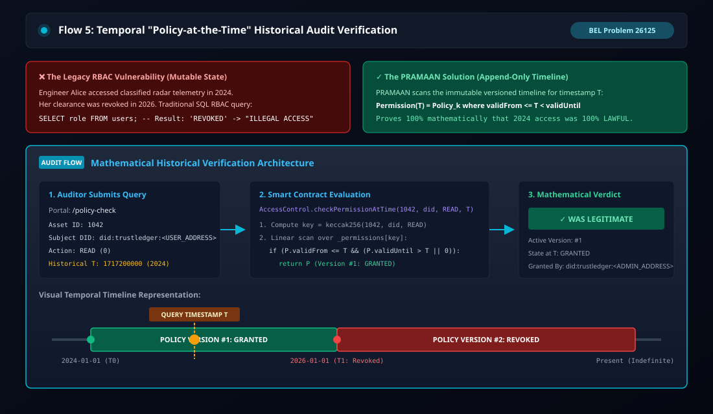
</p>

<details>
<summary><b>🔍 Click to expand Raw Temporal Audit Sequence Protocol</b></summary>

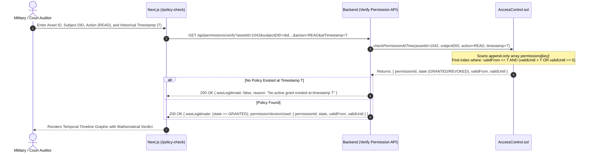
```mermaid
sequenceDiagram
    autonumber
    actor Auditor as Military / Court Auditor
    participant UI as Next.js (/policy-check)
    participant API as Backend (Verify Permission API)
    participant ACC as AccessControl.sol

    Auditor->>UI: Enter Asset ID, Subject DID, Action (READ), and Historical Timestamp (T)
    UI->>API: GET /api/permissions/verify?assetId=1042&subjectDID=did:...&action=READ&atTimestamp=T
    API->>ACC: checkPermissionAtTime(assetId=1042, subjectDID, action=READ, timestamp=T)
    
    Note over ACC: Scans append-only array permissions[key]:<br/>Find index where: validFrom <= T AND (validUntil > T OR validUntil == 0)
    
    ACC-->>API: Returns: { permissionId, state (GRANTED/REVOKED), validFrom, validUntil }
    
    alt No Policy Existed at Timestamp T
        API-->>UI: 200 OK { wasLegitimate: false, reason: "No active grant existed at timestamp T" }
    else Policy Found
        API-->>UI: 200 OK { wasLegitimate: (state == GRANTED), permissionVersionUsed: { permissionId, state, validFrom, validUntil } }
    end
    
    UI-->>Auditor: Renders Temporal Timeline Graphic with Mathematical Verdict
```
</details>

<details>
<summary><b>🔍 Expand to inspect Temporal Resolution Logic & Edge Cases</b></summary>

#### Temporal Resolution Algorithm
```
Input: assetId, subjectDID, action, timestamp T

1. key = keccak256(assetId, subjectDID, action)
2. permissionsList = _permissions[key]
3. If permissionsList is empty -> Return REVOKED (Safe Default)
4. For each permission P in permissionsList:
     If (P.validFrom <= T) AND (P.validUntil == 0 OR T < P.validUntil):
         Return P (Match Found)
5. Return REVOKED
```

| Scenario | Condition | Result |
| :--- | :--- | :--- |
| **Historical Access (Before Revocation)** | $T = 2024$, Revocation happened in $2026$ | **LEGITIMATE** (`GRANTED` version was active) |
| **Historical Access (After Revocation)** | $T = 2026.5$, Revocation happened in $2026$ | **UNAUTHORIZED** (`REVOKED` version was active) |
| **Prior to First Grant** | $T < \text{validFrom}_0$ | **UNAUTHORIZED** (No active grant) |
| **Subject Identity Revoked Later** | Identity revoked in 2026, checking 2024 | **LEGITIMATE** (Revocation does NOT rewrite past history) |
</details>

---

#### Flow 6: Independent Third-Party Proof Verification (Level 2)
Completely autonomous verification. Requires zero credentials on the PRAMAAN platform.

<p align="center">
  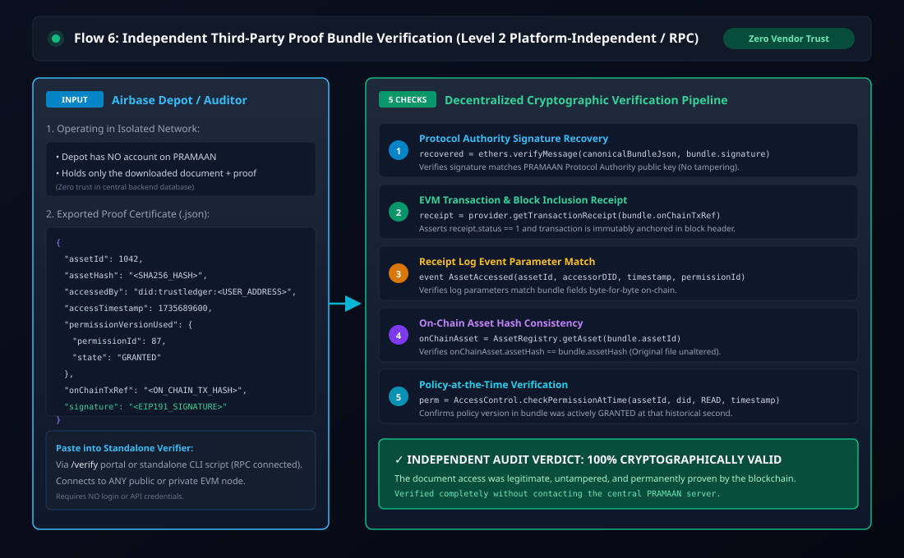
</p>

<details>
<summary><b>🔍 Click to expand Raw Independent Verification Sequence Protocol</b></summary>

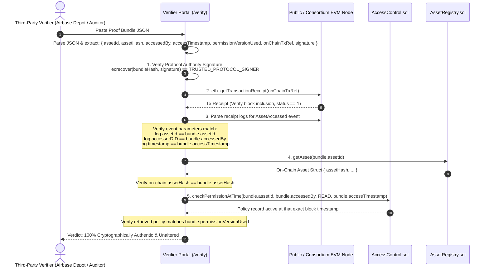
```mermaid
sequenceDiagram
    autonumber
    actor ThirdParty as Third-Party Verifier (Airbase Depot / Auditor)
    participant UI as Verifier Portal (/verify)
    participant RPC as Public / Consortium EVM Node
    participant ACC as AccessControl.sol
    participant AR as AssetRegistry.sol

    ThirdParty->>UI: Paste Proof Bundle JSON
    UI->>UI: Parse JSON & extract: { assetId, assetHash, accessedBy, accessTimestamp, permissionVersionUsed, onChainTxRef, signature }
    
    UI->>UI: 1. Verify Protocol Authority Signature:<br/>ecrecover(bundleHash, signature) == TRUSTED_PROTOCOL_SIGNER
    
    UI->>RPC: 2. eth_getTransactionReceipt(onChainTxRef)
    RPC-->>UI: Tx Receipt (Verify block inclusion, status == 1)
    
    UI->>RPC: 3. Parse receipt logs for AssetAccessed event
    Note over UI: Verify event parameters match:<br/>log.assetId == bundle.assetId<br/>log.accessorDID == bundle.accessedBy<br/>log.timestamp == bundle.accessTimestamp
    
    UI->>AR: 4. getAsset(bundle.assetId)
    AR-->>UI: On-Chain Asset Struct { assetHash, ... }
    Note over UI: Verify on-chain assetHash == bundle.assetHash
    
    UI->>ACC: 5. checkPermissionAtTime(bundle.assetId, bundle.accessedBy, READ, bundle.accessTimestamp)
    ACC-->>UI: Policy record active at that exact block timestamp
    Note over UI: Verify retrieved policy matches bundle.permissionVersionUsed
    
    UI-->>ThirdParty: Verdict: 100% Cryptographically Authentic & Unaltered
```
</details>

---

#### Flow 7: Dual-Custody Multi-Officer Authorization (Two-Man Rule)
For sensitive assets classified as `CONFIDENTIAL`, unilateral single-signature permissions are prevented on-chain. Two distinct active officers must approve the change before it takes effect on the immutable versioned timeline:

<p align="center">
  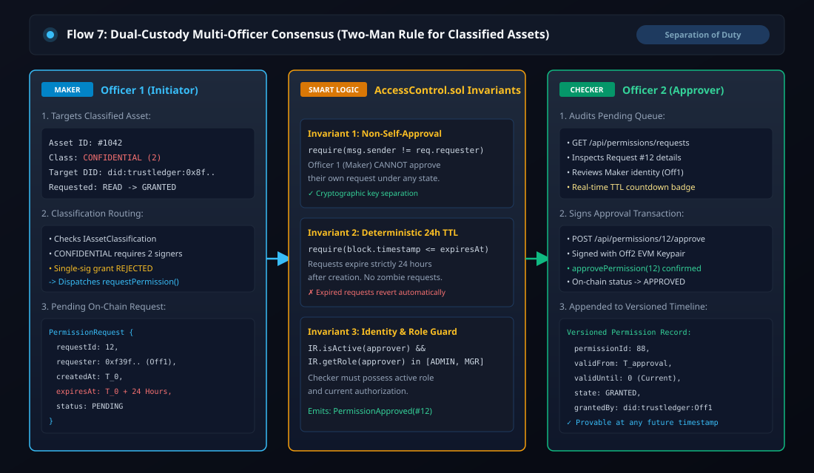
</p>

<details>
<summary><b>🔍 Click to expand Dual-Custody Multi-Officer Consensus Sequence Protocol</b></summary>

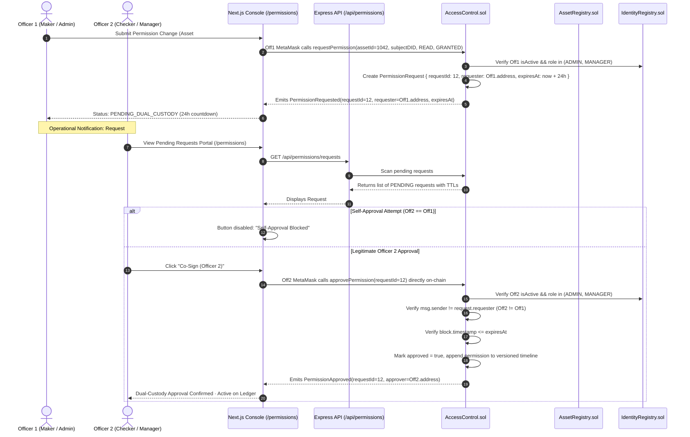
```mermaid
sequenceDiagram
    autonumber
    actor Off1 as Officer 1 (Maker / Admin)
    actor Off2 as Officer 2 (Checker / Manager)
    participant UI as Next.js Console (/permissions)
    participant API as Express API (/api/permissions)
    participant ACC as AccessControl.sol
    participant AR as AssetRegistry.sol
    participant IR as IdentityRegistry.sol

    Off1->>UI: Submit Permission Change (Asset #1042, CONFIDENTIAL, Subject DID, READ)
    UI->>ACC: Off1 MetaMask calls requestPermission(assetId=1042, subjectDID, READ, GRANTED)
    ACC->>IR: Verify Off1 isActive && role in (ADMIN, MANAGER)
    ACC->>ACC: Create PermissionRequest { requestId: 12, requester: Off1.address, expiresAt: now + 24h }
    ACC-->>UI: Emits PermissionRequested(requestId=12, requester=Off1.address, expiresAt)
    UI-->>Off1: Status: PENDING_DUAL_CUSTODY (24h countdown)
    
    Note over Off1,Off2: Operational Notification: Request #12 requires Officer 2 co-signature

    Off2->>UI: View Pending Requests Portal (/permissions)
    UI->>API: GET /api/permissions/requests
    API->>ACC: Scan pending requests
    ACC-->>API: Returns list of PENDING requests with TTLs
    API-->>UI: Displays Request #12 (Requester: Off1.address, Expiration Countdown)

    alt Self-Approval Attempt (Off2 == Off1)
        UI->>UI: Button disabled: "Self-Approval Blocked"
    else Legitimate Officer 2 Approval
        Off2->>UI: Click "Co-Sign (Officer 2)"
        UI->>ACC: Off2 MetaMask calls approvePermission(requestId=12) directly on-chain
        ACC->>IR: Verify Off2 isActive && role in (ADMIN, MANAGER)
        ACC->>ACC: Verify msg.sender != request.requester (Off2 != Off1)
        ACC->>ACC: Verify block.timestamp <= expiresAt
        ACC->>ACC: Mark approved = true, append permission to versioned timeline
        ACC-->>UI: Emits PermissionApproved(requestId=12, approver=Off2.address)
        UI-->>Off2: Dual-Custody Approval Confirmed · Active on Ledger
    end
```
</details>

---

### 2.3 Cryptographic Key Hierarchy & Security Boundary

To eliminate cross-contamination of trust, PRAMAAN strictly enforces separation between 4 distinct keys:

<p align="center">
  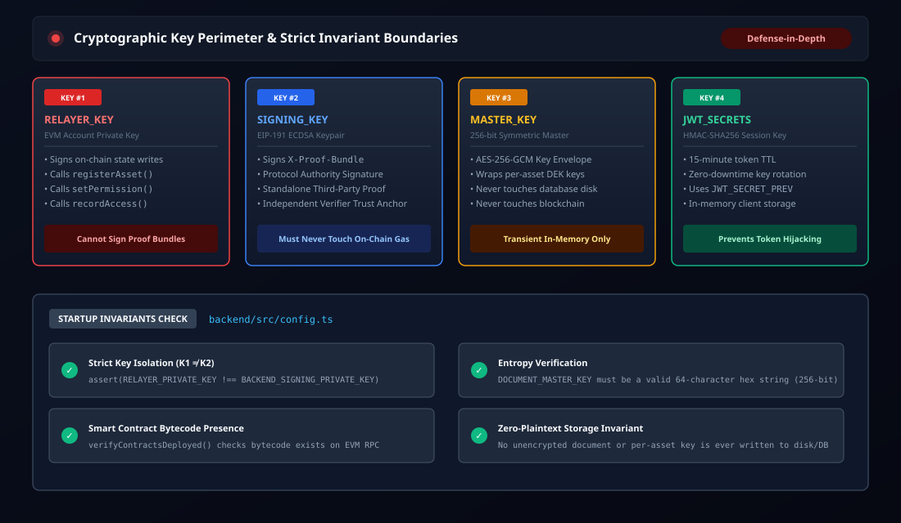
</p>

<details>
<summary><b>🔍 Click to expand Raw Key Hierarchy Flowchart</b></summary>

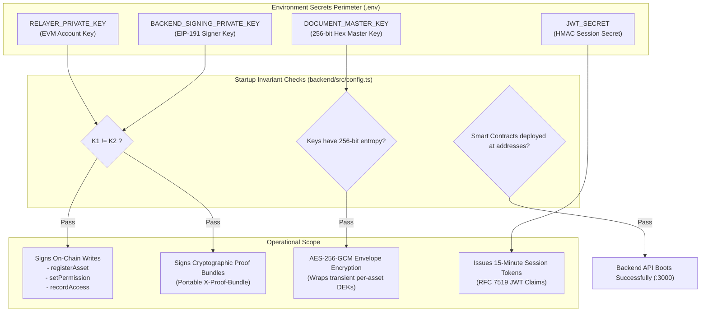
```mermaid
flowchart TD
    subgraph EnvConfig["Environment Secrets Perimeter (.env)"]
        K1["RELAYER_PRIVATE_KEY<br/>(EVM Account Key)"]
        K2["BACKEND_SIGNING_PRIVATE_KEY<br/>(EIP-191 Signer Key)"]
        K3["DOCUMENT_MASTER_KEY<br/>(256-bit Hex Master Key)"]
        K4["JWT_SECRET<br/>(HMAC Session Secret)"]
    end

    subgraph Enforcements["Startup Invariant Checks (backend/src/config.ts)"]
        Check1{"K1 != K2 ?"}
        Check2{"Keys have 256-bit entropy?"}
        Check3{"Smart Contracts deployed at addresses?"}
    end

    subgraph Domains["Operational Scope"]
        D1["Signs On-Chain Writes<br/>- registerAsset<br/>- setPermission<br/>- recordAccess"]
        D2["Signs Cryptographic Proof Bundles<br/>(Portable X-Proof-Bundle)"]
        D3["AES-256-GCM Envelope Encryption<br/>(Wraps transient per-asset DEKs)"]
        D4["Issues 15-Minute Session Tokens<br/>(RFC 7519 JWT Claims)"]
    end

    K1 --> Check1
    K2 --> Check1
    K3 --> Check2
    Check1 -- Pass --> D1 & D2
    Check2 -- Pass --> D3
    K4 --> D4
    Check3 -- Pass --> ServerStart["Backend API Boots Successfully (:3000)"]
```
</details>

### Defense-in-Depth Invariant Checklist

- [x] **Key Separation**: `RELAYER_PRIVATE_KEY != BACKEND_SIGNING_PRIVATE_KEY` checked on process startup.
- [x] **Zero-Knowledge Blockchain**: Document plaintext, AES keys, and user PII (names, emails) **never** touch contract calls.
- [x] **Anti-Replay Nonces**: Authentication challenges have a 5-minute expiry and are flagged `consumed = true` immediately upon verification.
- [x] **OWASP Top 10 Headers**: Helmet middleware automatically injects HSTS, strict CSP, X-Frame-Options (`DENY`), and Content-Type sniffing prevention.
- [x] **Strict Rate Limiting**: Tiered IP limiting prevents denial-of-service (Auth: 10 req/15min, Writes: 20 req/15min, Reads: 60 req/15min).

---

### 2.4 Smart Contracts Reference Matrix

All three contracts reside in [`contracts/contracts/`](../contracts/contracts) and run on Cancun EVM:

#### Contract 1: `IdentityRegistry.sol`
*The canonical registry for Decentralized Identifiers and administrative roles.*

| Method / Event | Type | Visibility | Access Constraint | Purpose |
| :--- | :--- | :--- | :--- | :--- |
| `registerIdentity(did, pubKey, role)` | State Write | `external` | `onlyActiveAdmin` | Creates new on-chain identity record |
| `revokeIdentity(subject)` | State Write | `external` | `onlyActiveAdmin` | Sets status to `REVOKED` (never deletes) |
| `resolveDID(did)` | View | `external` | Public | Returns resolved Ethereum address |
| `isActive(subject)` | View | `external` | Public | Checks registered == true && status == ACTIVE |
| `getRole(subject)` | View | `external` | Public | Returns `Role` enum (ADMIN, MANAGER, AUDITOR, USER) |
| `IdentityRegistered` | Event | — | — | Emitted upon identity registration |
| `IdentityRevoked` | Event | — | — | Emitted upon identity revocation |

#### Contract 2: `AccessControl.sol`
*The append-only dynamic RBAC engine with temporal query capabilities and dual-custody consensus.*

| Method / Event | Type | Visibility | Access Constraint | Purpose |
| :--- | :--- | :--- | :--- | :--- |
| `setPermission(assetId, did, action, state)` | State Write | `external` | `onlyActiveAdminOrManager` | Closes previous version & appends new policy (direct single-sig) |
| `requestPermission(assetId, did, action, state)` | State Write | `external` | `onlyActiveAdminOrManager` | Classification-aware: single-sig for PUBLIC/INTERNAL; routes CONFIDENTIAL to dual-custody |
| `approvePermission(requestId)` | State Write | `external` | Active Admin/Manager (`msg.sender != requester`) | Approves dual-custody request within 24h TTL; appends to versioned timeline |
| `cancelPermissionRequest(requestId)` | State Write | `external` | Requester or Active Admin | Cancels pending dual-custody request |
| `checkPermissionNow(assetId, did, action)` | View | `external` | Public | Checks active policy AND subject's `isActive()` |
| `checkPermissionAtTime(assetId, did, action, T)` | View | `external` | Public | **CORE USP**: Scans timeline for policy active at $T$ |
| `recordAccess(assetId, did, permId)` | State Write | `external` | Valid Caller | Re-checks policy and emits `AssetAccessed` log |
| `setAssetRegistry(assetRegistry)` | State Write | `external` | Deployer Only | One-shot initializer linking AssetRegistry for classification checks |
| `PermissionChanged` | Event | — | — | Emitted upon every grant or revocation |
| `PermissionRequested` | Event | — | — | Emitted when a dual-custody request is initiated |
| `PermissionApproved` | Event | — | — | Emitted when Officer 2 approves dual-custody request |
| `PermissionRequestCancelled` | Event | — | — | Emitted when a pending request is cancelled |
| `AssetAccessed` | Event | — | — | Immutably anchors asset download receipt |

#### Contract 3: `AssetRegistry.sol` (ERC-721)
*NFT tokenization of encrypted digital assets and ownership transfers.*

| Method / Event | Type | Visibility | Access Constraint | Purpose |
| :--- | :--- | :--- | :--- | :--- |
| `registerAsset(hash, ownerDID, uri, class)` | State Write | `external` | `onlyActiveAdmin` | Mints ERC-721 token & records asset metadata |
| `transferAsset(to, assetId)` | State Write | `external` | Admin / Authorized | Transfers token ownership and updates `ownerDID` |
| `updateAssetVersion(id, newHash, newUri)` | State Write | `external` | `onlyActiveAdmin` | Increments version number on document update |
| `getAsset(assetId)` | View | `external` | Public | Returns full `Asset` struct |
| `AssetRegistered` | Event | — | — | Emitted when a new asset is minted |
| `AssetOwnershipTransferred` | Event | — | — | Emitted upon ERC-721 ownership transfer |

---

### 2.5 Port Allocation & Runtime Network Summary

| Service | Port | Protocol / Transport | Purpose |
| :--- | :--- | :--- | :--- |
| **Next.js Frontend** | `3001` | HTTP / App Router | User interface, wallet bridge, and audit verifier |
| **Express Backend** | `3000` | HTTP / REST JSON | API gateway, auth, encryption, and relayer orchestration |
| **PostgreSQL Database** | `5432` | TCP / PostgreSQL Wire | Encrypted records, wrapped keys, challenges, audit logs |
| **Hardhat EVM Node** | `8545` | JSON-RPC 2.0 (HTTP) | Local Cancun EVM blockchain with 20 pre-funded test accounts |

---

### 2.6 Live Inspection & Debugging Handbook

Use these interactive terminal commands to inspect system state during live testing:

<details>
<summary><b>🛠 Click to view Live Testing & Inspection Commands</b></summary>

#### 1. Check PostgreSQL Encrypted Records
```bash
# Connect to running Docker database
docker exec -it trustledger-postgres-1 psql -U postgres -d trustledger

# Query stored encrypted records (Notice raw data key is NOT stored)
SELECT metadata_uri, asset_id, original_filename, mime_type, created_at FROM encrypted_records;

# Query derived audit log mirror
SELECT id, event_type, actor_did, asset_id, tx_hash FROM audit_log ORDER BY id DESC LIMIT 5;
```

#### 2. Query Local Blockchain EVM
```bash
# Call IdentityRegistry.resolveDID from terminal
cast call <IDENTITY_REGISTRY_ADDRESS> "resolveDID(string)(address)" "did:trustledger:<USER_ADDRESS>" --rpc-url http://127.0.0.1:8545

# Query current block number
cast block-number --rpc-url http://127.0.0.1:8545
```

#### 3. Test API Health & Contract Verification
```bash
# Verify backend is running and contracts are verified
curl -s http://localhost:3000/api/health | jq .
```
</details>

---

*Authored for Bharat Electronics Limited (BEL) &bull; Ministry of Defence, Government of India &bull; Smart India Hackathon 2026*
