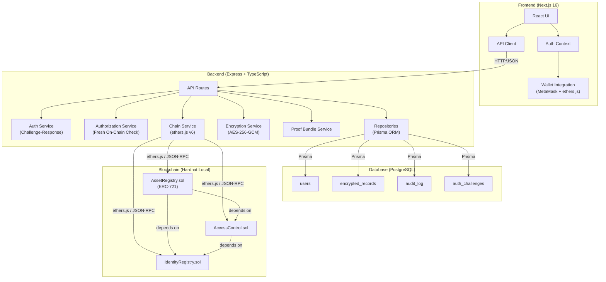
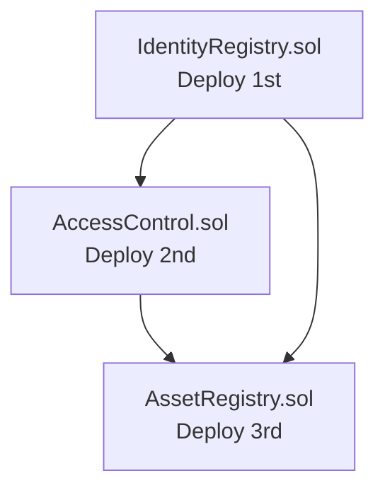
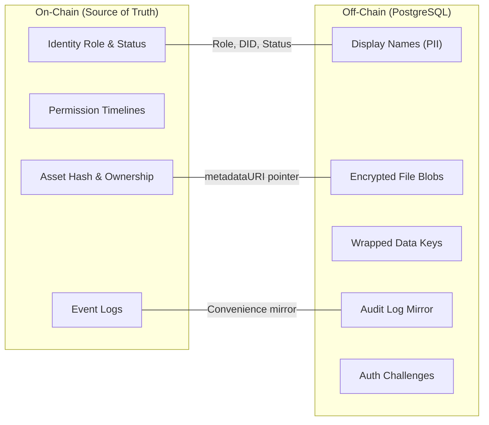
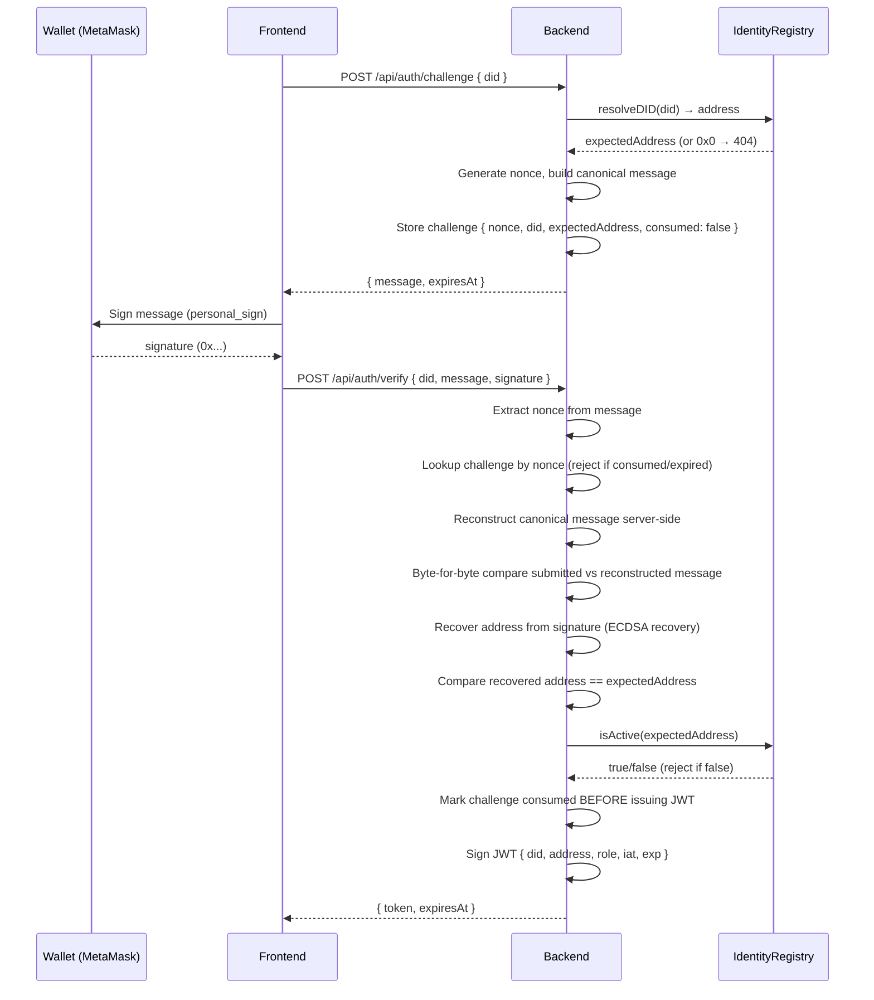
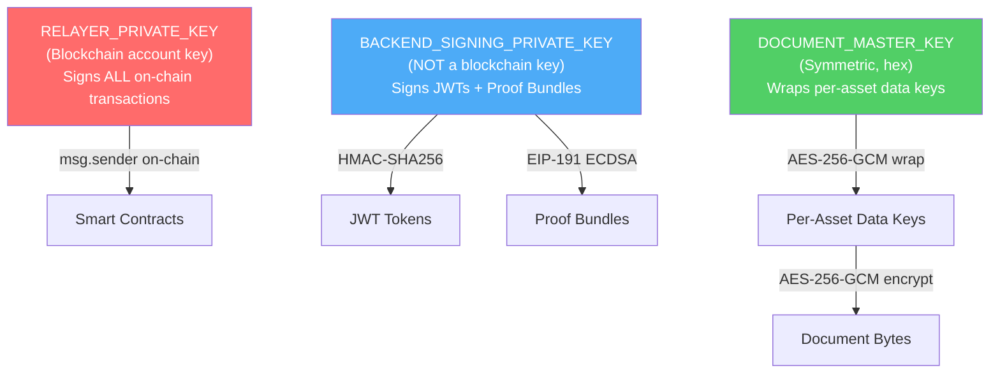
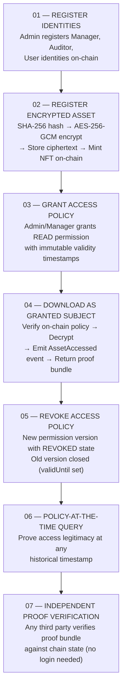
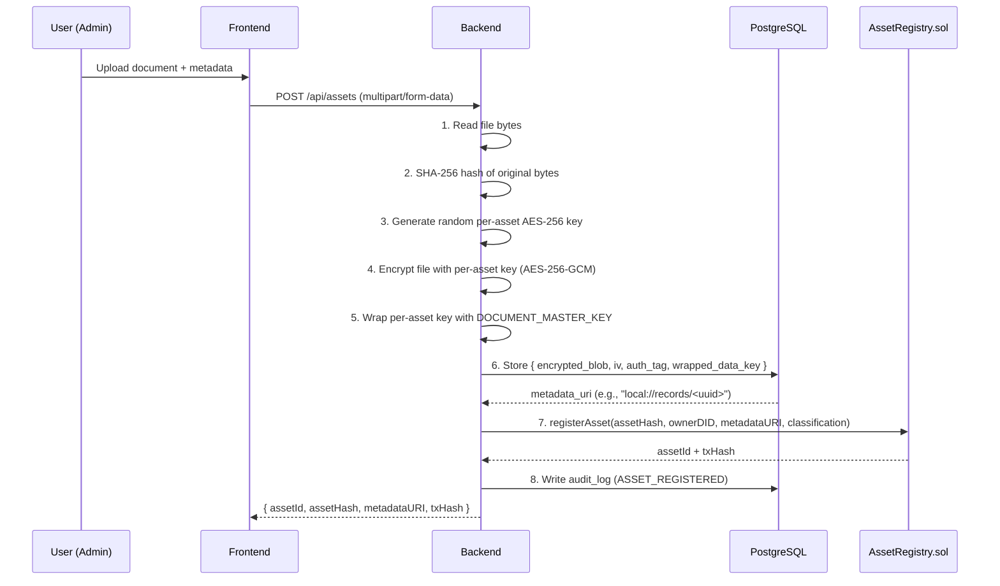
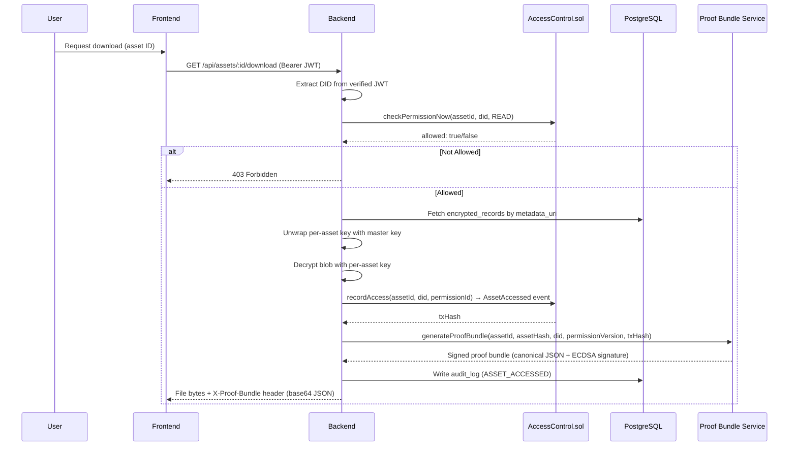
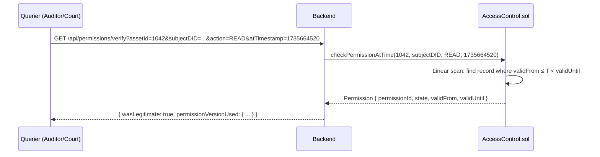
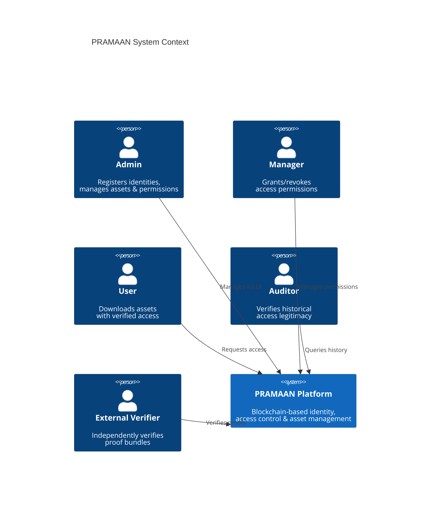

# PRAMAAN — Comprehensive Project Documentation

> **Blockchain-Based Secure Platform for Identity, Access Control, and Digital Asset Management**

---

## Table of Contents

1. [Project Overview](#1-project-overview)
2. [Problem Statement](#2-problem-statement)
3. [Unique Selling Propositions (USPs)](#3-unique-selling-propositions-usps)
4. [Technology Stack](#4-technology-stack)
5. [System Architecture](#5-system-architecture)
6. [Smart Contracts (Blockchain Layer)](#6-smart-contracts-blockchain-layer)
7. [Backend (API Layer)](#7-backend-api-layer)
8. [Frontend (Presentation Layer)](#8-frontend-presentation-layer)
9. [Data Model](#9-data-model)
10. [Security Architecture](#10-security-architecture)
11. [Working Flow](#11-working-flow)
12. [System Design Diagrams](#12-system-design-diagrams)
13. [Deployment Architecture](#13-deployment-architecture)
14. [Testing & Quality Assurance](#14-testing--quality-assurance)
15. [Feasibility Analysis](#15-feasibility-analysis)
16. [Real-World Viability](#16-real-world-viability)
17. [Impact & Benefits](#17-impact--benefits)
18. [Known Limitations & Accepted Tradeoffs](#18-known-limitations--accepted-tradeoffs)
19. [Future Scope](#19-future-scope)
20. [Repository Structure](#20-repository-structure)

---

## 1. Project Overview

**PRAMAAN** (codenamed *TrustLedger* in the repository) is a blockchain-based platform that secures identity management, access control, and digital asset provenance for government and enterprise critical infrastructure systems. Built for **SIH Problem Statement 26125** by **Bharat Electronics Limited (BEL)**, it addresses the security and auditability challenges of managing compliance, maintenance, and spares-authorization records for systems with 20–30 year operational service lives.

Every identity in the system is a **Decentralized Identifier (DID)**. Every record is hashed, encrypted off-chain, and represented on-chain as a unique **NFT (ERC-721 token)**. **Role-Based Access Control** (Admin / Manager / Auditor / User) is enforced by smart contracts, not application code. All operations — identity creation, NFT creation, asset allocation, access rights assignment, ownership transfers, and permission updates — are immutably recorded on the blockchain.

The platform is architected as a **permissioned/consortium-style blockchain system** with relayer-mediated writes and backend-enforced role gating, with on-chain enforcement for all reads and verification paths. It currently runs on a local Hardhat node for development and demonstration, with an explicit, separate future step of migrating to a real permissioned network (e.g., a private Besu/Quorum chain) if persistence beyond a demo is needed.

---

## 2. Problem Statement

### SIH Problem Statement 26125

| Field | Value |
|---|---|
| **Problem Statement ID** | 26125 |
| **Title** | Blockchain-Based Secure Platform for Identity, Access Control, and Digital Asset Management |
| **Organization** | Bharat Electronics Limited |
| **Department** | Bharat Electronics Limited |
| **Category** | Software |
| **Theme** | Blockchain & Cybersecurity |

### Background

Organizations today rely heavily on centralized identity and access management systems, which create significant security and operational risks. These systems are vulnerable to cyber attacks, identity theft, unauthorized access, and single points of failure. Digital and physical asset ownership is often managed through disconnected or semi-centralized systems, making verification of authenticity, access rights, and ownership history difficult and unreliable.

### Core Challenges Addressed

| Challenge | PRAMAAN's Solution |
|---|---|
| **Centralized single points of failure** | Decentralized blockchain with smart contract enforcement |
| **Identity theft and impersonation** | Cryptographic DIDs with challenge-response authentication |
| **Unauthorized access** | On-chain RBAC enforced by smart contracts, not application code |
| **Opaque audit trails** | Every operation immutably recorded on-chain with timestamped events |
| **Untraceable ownership history** | ERC-721 NFTs with full transfer history and versioned permission timelines |
| **Offline or retroactive access disputes** | Policy-at-the-time verification proving legitimacy at any historical moment |

---

## 3. Unique Selling Propositions (USPs)

PRAMAAN goes beyond standard RBAC + NFT systems with two core innovations:

### USP 1: Policy-at-the-Time Verification

Permissions are stored as a **versioned timeline**, not a single current-state row. The system can cryptographically prove whether an access was legitimate under the rules that existed at the **exact moment it happened**, not just what the rules are now.

Concretely: when a permission is granted or revoked, the existing permission record's `validUntil` is set to the current timestamp, and a new record with the new state is appended — old records are **never overwritten or deleted**. To check historical authorization, the system finds the record where `validFrom ≤ T < validUntil` for the queried timestamp `T`.

This is implemented in [`AccessControl.sol`](file:///d:/SIH'26/Project%20Files/TrustLedger/trustledger/contracts/contracts/AccessControl.sol)'s `checkPermissionAtTime()` function and exposed via the backend's `GET /api/permissions/verify` endpoint.

### USP 2: Portable Proof-of-Access (Proof Bundles)

Every verified access generates a **signed, exportable proof bundle** — a self-contained JSON document that any third party (auditor, court, external depot) can verify completely independently, without trusting or contacting the PRAMAAN platform. The proof bundle contains:

- The asset ID, hash, and access timestamp
- The permission version that was in effect at the time of access
- The on-chain transaction reference for the `AssetAccessed` event
- A cryptographic signature from the backend's signing key

Verification happens at three levels:

| Level | Name | What It Requires | Status |
|---|---|---|---|
| **Level 1** | Platform Verification | PRAMAAN UI → PRAMAAN backend → blockchain | ✅ Built |
| **Level 2** | Independent Online Verification | Proof bundle → any verifier → any RPC endpoint → blockchain | ✅ Built |
| **Level 3** | True Offline Verification | Proof bundle → local blockchain checkpoint → no network | 🔮 Future Scope |

> [!IMPORTANT]
> The current MVP builds **Level 2 verification** — independent of this specific backend instance, but requiring network access to a blockchain node. This is "platform-independent verification," **not** "offline verification."

---

## 4. Technology Stack

### Overview

```
┌─────────────────────────────────────────────────────────────┐
│                      FRONTEND LAYER                          │
│  Next.js 16.3  •  React 19  •  TypeScript  •  Tailwind v4  │
│  ethers.js v6 (wallet)  •  MetaMask Integration              │
├─────────────────────────────────────────────────────────────┤
│                      BACKEND LAYER                           │
│  Node.js  •  TypeScript  •  Express 5  •  Prisma ORM        │
│  ethers.js v6 (chain)  •  JWT (jsonwebtoken)  •  Zod         │
│  AES-256-GCM (Node crypto)  •  SHA-256                       │
├─────────────────────────────────────────────────────────────┤
│                     DATABASE LAYER                            │
│  PostgreSQL 16 (Alpine, via Docker)  •  Prisma Migrations    │
├─────────────────────────────────────────────────────────────┤
│                    BLOCKCHAIN LAYER                           │
│  Solidity ^0.8.24  •  Hardhat  •  OpenZeppelin Contracts 5.x │
│  ERC-721 (NFT)  •  Local Hardhat Network (Cancun EVM)        │
└─────────────────────────────────────────────────────────────┘
```

### Detailed Stack

#### Blockchain / Smart Contracts

| Component | Technology | Version | Purpose |
|---|---|---|---|
| Language | Solidity | ^0.8.24 | Smart contract development |
| Framework | Hardhat | ^2.22.0 | Compilation, testing, local chain |
| EVM Target | Cancun | — | Required for OpenZeppelin 5.x's `mcopy` opcode |
| NFT Standard | OpenZeppelin ERC-721 | ^5.0.0 | Asset tokenization |
| Testing | Hardhat Toolbox (Mocha + Chai) | ^5.0.0 | 56 passing tests across 3 contracts |
| Network | Local Hardhat Node | — | `http://127.0.0.1:8545` (Chain ID 31337) |

#### Backend

| Component | Technology | Version | Purpose |
|---|---|---|---|
| Runtime | Node.js | LTS (20.x / 22.x) | Server runtime |
| Language | TypeScript | ^5.5.0 | Type-safe development |
| Framework | Express | ^5.2.1 | HTTP API server |
| Blockchain SDK | ethers.js | ^6.13.0 | Contract interaction |
| ORM | Prisma | ^5.17.0 | PostgreSQL access + migrations |
| Auth | jsonwebtoken | ^9.0.0 | JWT session tokens (15-min TTL) |
| Validation | Zod | ^4.6.5 | Input validation |
| File Upload | Multer | ^2.2.0 | `multipart/form-data` parsing |
| Security | Helmet | ^8.3.0 | OWASP security headers |
| Rate Limiting | express-rate-limit | ^8.7.0 | IP-based rate limiting |
| Encryption | Node.js `crypto` | Built-in | AES-256-GCM + SHA-256 |
| Testing | Jest + Supertest | ^29.7.0 / ^7.0.0 | Unit + integration tests |

#### Frontend

| Component | Technology | Version | Purpose |
|---|---|---|---|
| Framework | Next.js | 16.3.5 | React meta-framework (App Router) |
| UI Library | React | 19.2.8 | Component-based UI |
| Language | TypeScript | ^5 | Type-safe development |
| Styling | Tailwind CSS | ^4 | Utility-first CSS |
| Blockchain SDK | ethers.js | ^6.17.0 | MetaMask wallet integration |
| Typography | Instrument Serif, Instrument Sans, JetBrains Mono | Google Fonts | Premium UI typography |
| Design System | Custom components (Card, Badge, NavBar, etc.) | — | Consistent UI elements |
| Theming | Custom ThemeContext | — | Dark/light mode with system preference |

#### Infrastructure

| Component | Technology | Version | Purpose |
|---|---|---|---|
| Database | PostgreSQL | 16-alpine | Off-chain encrypted data + audit log |
| Containerization | Docker Compose | — | Local dev Postgres instance |
| Package Manager | npm | — | Dependency management |

---

## 5. System Architecture

### High-Level Architecture



### Cross-Contract Dependency (Strict Deployment Order)



`AccessControl` depends on `IdentityRegistry` (identity/role checks). `AssetRegistry` depends on **both** `IdentityRegistry` (identity/role checks) **and** `AccessControl` (TRANSFER permission checks). Addresses are injected via constructors — never hardcoded.

### Data Flow Between Layers



> [!NOTE]
> The on-chain data is **authoritative** for identity, roles, permissions, ownership, and asset integrity. PostgreSQL stores **only** what must never go on-chain (encrypted file bytes, PII) plus a convenience audit log. On-chain events remain the source of truth for anything disputed.

---

## 6. Smart Contracts (Blockchain Layer)

Three Solidity contracts, kept separate by design:

### 6.1 IdentityRegistry.sol

**Purpose:** Canonical resolver between DID strings and addresses, and the single source of truth for identity role and active/revoked status.

| Feature | Detail |
|---|---|
| **Enums** | `Role` (NONE, ADMIN, MANAGER, AUDITOR, USER), `IdentityStatus` (ACTIVE, REVOKED) |
| **Struct** | `Identity { did, publicKey, role, status, createdAt }` |
| **Bootstrap** | Deployer becomes the first ADMIN automatically in the constructor |
| **DID Resolution** | `resolveDID(did)` → address (canonical, used system-wide) |
| **Mappings** | `address → Identity`, `DID string → address`, `address → registered` |

**Key Functions:**

| Function | Access | Description |
|---|---|---|
| `registerIdentity()` | Active ADMIN only | Register a new DID with role. Rejects duplicate DIDs. |
| `revokeIdentity()` | Active ADMIN only | Sets status to REVOKED. Does **not** delete the record or clear the DID→address mapping. |
| `getIdentity()` | Public (view) | Returns full Identity struct. Reverts if unregistered. |
| `isActive()` | Public (view) | Returns `true` if registered AND status is ACTIVE. |
| `getRole()` | Public (view) | Returns `Role.NONE` for unregistered (no revert). |
| `resolveDID()` | Public (view) | Returns `address(0)` for unknown DIDs. |

**Events:** `IdentityRegistered`, `IdentityRevoked`

### 6.2 AccessControl.sol — The Core USP

**Purpose:** Versioned permission management with historical query capability. Permissions are **never overwritten or deleted**.

| Feature | Detail |
|---|---|
| **Enums** | `Action` (READ, WRITE, TRANSFER), `PermissionState` (GRANTED, REVOKED) |
| **Struct** | `Permission { permissionId, assetId, subjectDID, action, state, grantedBy, validFrom, validUntil }` |
| **Storage** | `mapping(bytes32 => Permission[])` keyed by `keccak256(assetId, subjectDID, action)` |
| **Append-only** | New permissions are pushed; old ones get `validUntil` set — never removed |

**Key Functions:**

| Function | Access | Description |
|---|---|---|
| `setPermission()` | Active ADMIN or MANAGER | Appends a new permission record. Closes the previous current record. `grantedBy` is derived from `msg.sender`'s DID, never caller-supplied. |
| `checkPermissionAtTime()` | Public (view) | **THE CORE USP.** Linear scan to find the record where `validFrom ≤ T < validUntil`. Returns REVOKED as safe default if no record found. Does **not** check current identity status (by design — revocation should not retroactively rewrite history). |
| `checkPermissionNow()` | Public (view) | Current-time convenience wrapper. Unlike `checkPermissionAtTime`, this **also** checks `isActive()` on the subject's identity. A revoked identity is denied immediately. |
| `recordAccess()` | Active identity | Independently re-verifies authorization before emitting `AssetAccessed`. Cannot be called to manufacture fake access events. |

**Events:** `PermissionChanged`, `AssetAccessed`

**Two Distinct Authorization Modes:**

```
checkPermissionNow:    Permission State + Identity isActive() = BOTH required
checkPermissionAtTime: Permission State ONLY (historical, no retroactive revocation)
```

### 6.3 AssetRegistry.sol (ERC-721)

**Purpose:** NFT-backed asset records where each token represents ownership of an asset record.

| Feature | Detail |
|---|---|
| **Inherits** | OpenZeppelin `ERC721("TrustLedger Asset", "TLA")` |
| **Enums** | `AssetStatus` (ACTIVE, REVOKED), `Classification` (PUBLIC, INTERNAL, CONFIDENTIAL) |
| **Struct** | `Asset { assetId, assetHash, ownerDID, metadataURI, classification, status, version, createdAt }` |
| **Token ID** | Same as `assetId` (auto-incremented from 1) |
| **Ownership Invariant** | `ownerDID` is **derived** from the ERC-721 token owner's address via `IdentityRegistry.getIdentity()` — never independently settable |

**Key Functions:**

| Function | Access | Description |
|---|---|---|
| `registerAsset()` | Active ADMIN | Mints ERC-721 token. Stores Asset struct. Follows checks-effects-interactions pattern. |
| `transferAsset()` | ADMIN or owner with TRANSFER permission | Updates ERC-721 owner AND `ownerDID` atomically. `newOwnerDID` is derived, never caller-supplied. |
| `updateAssetVersion()` | Active ADMIN | Increments version, updates hash/metadataURI, keeps same assetId. |
| `getAsset()` | Public (view) | Returns full Asset struct. |

**Events:** `AssetRegistered`, `AssetOwnershipTransferred`, `AssetVersionUpdated`

**Reentrancy Protection:** Follows checks-effects-interactions ordering — all internal state (Asset struct, `ownerDID`) is updated **before** the ERC-721 `_safeMint` / `_safeTransfer` call that could trigger `onERC721Received` hooks.

### 6.4 Testing

**56 total tests passing** across all three contracts:

| Contract | Tests | Key Scenarios |
|---|---|---|
| IdentityRegistry | 20 | Registration, revocation, DID uniqueness, non-admin rejection |
| AccessControl | 19 | Permission grant/revoke, **historical verification** (before + after changes), revoked identity denied, TOCTOU safety |
| AssetRegistry | 17 | Asset registration, transfer authorization, ownership consistency (`ownerOf` matches `ownerDID`), version updates |

---

## 7. Backend (API Layer)

### 7.1 Architecture

The backend is the orchestration layer between the frontend, smart contracts, and PostgreSQL. It does **not** contain business logic that belongs on-chain — permission enforcement, role checks, and ownership rules live in the contracts.

**Backend responsibilities:**
1. Authenticate identities (challenge-response + JWT)
2. Hash and encrypt files (SHA-256 + AES-256-GCM)
3. Call contracts via the relayer key
4. Store/retrieve off-chain encrypted data
5. Generate and verify proof bundles

### 7.2 Authentication — Challenge-Response with JWT

A multi-step cryptographic authentication flow:



**Canonical signable message format (domain-separated):**

```
PRAMAAN Authentication Request

Domain: trustledger.local
Purpose: Authenticate to PRAMAAN backend
DID: did:trustledger:0xABC...
Nonce: <128-bit+ cryptographically random hex>
Issued At: <ISO-8601>
Expiration: <ISO-8601>
```

**JWT Claims:** `{ did, address, role, iat, exp }` — 15-minute lifetime, signed with `JWT_SECRET` (HS256).

### 7.3 Authorization Trust Boundary

Two distinct authorization guarantees exist in the system:

#### Read/Access Path — Blockchain-Enforced (Stronger)

```
JWT → DID authentication → AccessControl.checkPermissionNow()
    → IdentityRegistry.isActive(subject) → permission state
```

The **contract** evaluates the real subject DID/address and current on-chain state directly. Identity revocation takes effect **immediately** for asset access.

#### Privileged Write Path — Backend-Enforced, Relayed (Distinct Guarantee)

```
JWT → authenticated DID → backend checks CURRENT on-chain role/status
    → backend relays transaction → contract authorizes the RELAYER
```

All state-changing contract calls are submitted by the backend's relayer key (`RELAYER_PRIVATE_KEY`). The contract sees `msg.sender = backend relayer`, not the actual human user. Therefore, the backend's **fresh `IdentityRegistry` check** (performed immediately before relaying) is the actual enforcement point for privileged writes.

> [!WARNING]
> This is **not cryptographically equivalent** to per-user transaction signing. The backend's role check is the effective authorization, not the contract's on-chain modifier for relayed writes. This is a deliberate MVP architecture tradeoff documented in BACKEND_SPEC.md.

### 7.4 API Endpoints

#### Authentication

| Method | Route | Auth | Description |
|---|---|---|---|
| `POST` | `/api/auth/challenge` | None | Issue a signed challenge for a DID |
| `POST` | `/api/auth/verify` | None | Verify signature and issue JWT |

#### Identity Management

| Method | Route | Auth | Description |
|---|---|---|---|
| `POST` | `/api/identities` | JWT (ADMIN) | Register new identity on-chain + Postgres |
| `GET` | `/api/identities/:did` | None | Lookup identity (merges on-chain + off-chain data) |

#### Asset Management

| Method | Route | Auth | Description |
|---|---|---|---|
| `POST` | `/api/assets` | JWT | Register asset: hash → encrypt → store → on-chain mint |
| `GET` | `/api/assets/:assetId` | None | Asset metadata (on-chain + Postgres, no file content) |
| `GET` | `/api/assets/:assetId/download` | JWT | Download: `checkPermissionNow` → decrypt → return file + proof bundle |

#### Permission Management

| Method | Route | Auth | Description |
|---|---|---|---|
| `POST` | `/api/permissions` | JWT (ADMIN/MANAGER) | Grant or revoke a permission on-chain |
| `GET` | `/api/permissions/verify` | None | **Core USP endpoint** — historical permission verification |

#### Proof Bundle Verification

| Method | Route | Auth | Description |
|---|---|---|---|
| `POST` | `/api/proof-bundles/verify` | None | Independent verification (Level 2) — anyone can verify |

### 7.5 Key Management (Two-Tier)

```
                    DOCUMENT_MASTER_KEY (env var, never persisted)
                         │
                  wraps / unwraps (AES-256-GCM)
                         │
                         ▼
               PER-ASSET DATA KEY (random, transient in memory only)
                         │
                  AES-256-GCM encrypt/decrypt
                         │
                         ▼
                   DOCUMENT BYTES
```

- Each uploaded asset gets a **unique, randomly generated** per-asset data key
- Document bytes are encrypted with that per-asset key (AES-256-GCM) → produces `encrypted_blob`, `iv`, `auth_tag`
- The per-asset key is wrapped (encrypted) under the master key → `wrapped_data_key`
- The master key lives in the environment variable, **never** in PostgreSQL, **never** on-chain
- The raw per-asset key exists only transiently in memory during encrypt/decrypt

### 7.6 Backend Security Hardening

| Feature | Implementation |
|---|---|
| **Security Headers** | Helmet middleware (HSTS, X-Content-Type-Options, X-Frame-Options, CSP) |
| **Rate Limiting** | Global IP-based (100 req/15min), per-endpoint limits (auth: 10, reads: 60, writes: 20, verify: 30) |
| **Input Validation** | Zod schemas for all request bodies |
| **Body Size Limit** | 1MB JSON body limit (DoS prevention) |
| **CORS** | Explicit origin whitelist |
| **Key Separation** | `RELAYER_PRIVATE_KEY` ≠ `BACKEND_SIGNING_PRIVATE_KEY` (enforced at startup) |
| **Startup Verification** | `verifyContractsDeployed()` confirms bytecode exists at all configured addresses before accepting requests |
| **JWT Key Rotation** | `JWT_SECRET_PREVIOUS` enables zero-downtime rotation |
| **Environment Validation** | All env vars validated at startup — format, entropy, uniqueness |

---

## 8. Frontend (Presentation Layer)

### 8.1 Framework & Architecture

Built with **Next.js 16.3** (App Router), **React 19**, **TypeScript**, and **Tailwind CSS v4**. The frontend uses a premium, editorial design system with dark/light theme support.

**Design System:**
- Typography: Instrument Serif (headings), Instrument Sans (body), JetBrains Mono (code)
- Theming: Custom `ThemeContext` with `data-theme` attribute, system preference detection, and `localStorage` persistence
- Components: Custom `Card`, `Badge`, `NavBar`, `NetworkBanner`, and icon set
- Visual effects: ASCII art animations (`AsciiSphere`, `AsciiCryptoCube`, `AsciiWaveField`), `NetworkBackground` particle system

### 8.2 Pages

| Page | Route | Purpose | Authentication |
|---|---|---|---|
| **Landing Page** | `/` | Feature showcase, 7-step operational sequence, developer SDK snippets, architecture overview | None |
| **Identities** | `/identities` | Register new identities (Admin-only), lookup identity by DID | JWT (for registration) |
| **Assets** | `/assets` | Register new encrypted assets (file upload), lookup asset metadata | JWT (for registration) |
| **Permissions** | `/permissions` | Grant/revoke access permissions for assets | JWT (ADMIN/MANAGER) |
| **Policy Check** | `/policy-check` | **Core USP UI** — query historical permission state at any timestamp | None (public) |
| **Download** | `/download` | Download assets with on-chain permission verification + proof bundle generation | JWT |
| **Verify** | `/verify` | Independent proof bundle verification (paste any bundle, no login needed) | None (public) |

### 8.3 Wallet Integration

The frontend integrates with **MetaMask** for wallet-based authentication:

- Chain detection and switching to the local Hardhat network (Chain ID 31337)
- DID derivation: `did:trustledger:<checksummed-address>`
- Message signing via `personal_sign` (EIP-191)
- JWT payload decoding (frontend-only convenience, never authoritative)
- Session is memory-only (React state) — intentionally **not** persisted to `localStorage`

### 8.4 Auth Context

A React context (`AuthProvider`) manages the complete authentication lifecycle:

```
Connect Wallet → Check Network → Post Challenge → Sign Message → Verify → Store JWT
```

- JWT expiry is actively surfaced (not silently hidden)
- Network mismatch errors are shown before authentication
- The auth state includes: `address`, `did`, `token`, `claims`, `isOnHardhat`, `loading`, `error`

---

## 9. Data Model

### 9.1 Identity

| Field | Type | Storage | Notes |
|---|---|---|---|
| `did` | string | On-chain + DB | Format: `did:trustledger:<address>` |
| `publicKey` | bytes | On-chain | Used for challenge-response auth |
| `role` | enum | On-chain | ADMIN \| MANAGER \| AUDITOR \| USER |
| `displayName` | string | DB only | Never on-chain (privacy) |
| `status` | enum | On-chain | ACTIVE \| REVOKED (current only) |
| `createdAt` | uint256 | On-chain | Unix timestamp |

### 9.2 Asset (Record)

| Field | Type | Storage | Notes |
|---|---|---|---|
| `assetId` | uint256 | On-chain | Auto-incremented, also the NFT token ID |
| `assetHash` | bytes32 | On-chain | SHA-256 of original (unencrypted) file |
| `ownerDID` | string | On-chain | Derived from ERC-721 token owner's address |
| `metadataURI` | string | On-chain | Pointer to `encrypted_records` in Postgres |
| `classification` | enum | On-chain | PUBLIC \| INTERNAL \| CONFIDENTIAL |
| `status` | enum | On-chain | ACTIVE \| REVOKED |
| `version` | uint256 | On-chain | Increments on re-registration |
| `createdAt` | uint256 | On-chain | Unix timestamp |

### 9.3 Permission (Versioned)

| Field | Type | Storage | Notes |
|---|---|---|---|
| `permissionId` | uint256 | On-chain | Auto-incremented |
| `assetId` | uint256 | On-chain | Which asset this applies to |
| `subjectDID` | string | On-chain | Who is granted/revoked |
| `action` | enum | On-chain | READ \| WRITE \| TRANSFER |
| `state` | enum | On-chain | GRANTED \| REVOKED |
| `grantedBy` | string | On-chain | DID of the authorizer |
| `validFrom` | uint256 | On-chain | When this version became active |
| `validUntil` | uint256 | On-chain | Timestamp of NEXT version, or 0 if still current |

### 9.4 Proof Bundle

```json
{
  "assetId": 1042,
  "assetHash": "0x7f8a...",
  "accessedBy": "did:trustledger:0xAbC123...",
  "accessTimestamp": 1735689600,
  "permissionVersionUsed": {
    "permissionId": 87,
    "state": "GRANTED",
    "validFrom": 1735660800,
    "validUntil": 0
  },
  "onChainTxRef": "0x9e1b...",
  "signature": "0x..."
}
```

### 9.5 PostgreSQL Schema (Prisma)

Four models, intentionally minimal:

| Table | Primary Key | Purpose |
|---|---|---|
| `users` | `did` | Off-chain PII (display name, email) |
| `encrypted_records` | `metadata_uri` | Encrypted file blobs + wrapped per-asset keys |
| `audit_log` | `id` (auto) | Convenience mirror of on-chain events |
| `auth_challenges` | `id` (auto) | Challenge-response nonce state |

---

## 10. Security Architecture

### 10.1 Cryptographic Primitives

| Purpose | Algorithm | Standard |
|---|---|---|
| Document Hashing | SHA-256 | FIPS 180-4 |
| Document Encryption | AES-256-GCM | NIST SP 800-38D |
| Key Wrapping | AES-256-GCM | Two-tier model |
| Authentication Signing | ECDSA (secp256k1) | EIP-191 (personal_sign) |
| JWT Signing | HMAC-SHA256 | RFC 7519 |
| Proof Bundle Signing | ECDSA (secp256k1) | EIP-191 |
| DID Resolution | keccak256 (on-chain) | Ethereum standard |

### 10.2 Key Architecture



> [!CAUTION]
> `RELAYER_PRIVATE_KEY` and `BACKEND_SIGNING_PRIVATE_KEY` **must** be different values. The backend enforces this at startup. They serve completely different purposes — conflating them defeats the security separation.

### 10.3 Access Control Matrix

| Operation | Auth Required | On-Chain Enforcement | Backend Enforcement |
|---|---|---|---|
| Register Identity | JWT (ADMIN) | `onlyActiveAdmin` modifier | Fresh `getRole()` + `isActive()` check |
| Revoke Identity | JWT (ADMIN) | `onlyActiveAdmin` modifier | Fresh role/status check |
| Register Asset | JWT (ADMIN) | `onlyActiveAdmin` modifier | Fresh role/status check |
| Set Permission | JWT (ADMIN/MANAGER) | `onlyActiveAdminOrManager` | Fresh role/status check |
| Download Asset | JWT (any authenticated) | `checkPermissionNow()` | JWT verification only |
| Verify Permission (historical) | None | `checkPermissionAtTime()` | None |
| Verify Proof Bundle | None | Re-queries chain state | Signature verification |
| Lookup Identity | None | `getIdentity()` | None |
| Lookup Asset Metadata | None | `getAsset()` | None |

### 10.4 Reentrancy Protection

| Contract | External Calls | Protection |
|---|---|---|
| IdentityRegistry | None | No external calls, no risk |
| AccessControl | `IdentityRegistry` (view only) | All calls are STATICCALL — read-only by EVM enforcement |
| AssetRegistry | `_safeMint()`, `_safeTransfer()` | Checks-effects-interactions: internal state updated **before** external call |

---

## 11. Working Flow

### 11.1 End-to-End Operational Sequence (7 Steps)



### 11.2 Asset Registration Flow (Detailed)



### 11.3 Asset Download Flow (with Proof Bundle Generation)



### 11.4 Policy-at-the-Time Verification Flow



---

## 12. System Design Diagrams

### 12.1 Overall System Context



### 12.2 Environment Variable / Key Architecture

```
┌────────────────────────────────────────────────────────────────┐
│                        .env (Backend)                          │
├────────────────────────────────────────────────────────────────┤
│ HARDHAT_RPC_URL          → Blockchain RPC endpoint             │
│ IDENTITY_REGISTRY_ADDRESS → On-chain contract address          │
│ ACCESS_CONTROL_ADDRESS    → On-chain contract address          │
│ ASSET_REGISTRY_ADDRESS    → On-chain contract address          │
│ RELAYER_PRIVATE_KEY       → Blockchain transaction signer      │
│ BACKEND_SIGNING_PRIVATE_KEY → JWT + proof bundle signer        │
│ DOCUMENT_MASTER_KEY       → AES-256 master key (key wrapping)  │
│ DATABASE_URL              → PostgreSQL connection string       │
│ AUTH_DOMAIN               → Domain separation for challenges   │
│ JWT_SECRET                → JWT signing (defaults to BSK)      │
│ JWT_SECRET_PREVIOUS       → Zero-downtime key rotation         │
│ PORT                      → Express server port (3000)         │
│ FRONTEND_ORIGIN           → CORS whitelist                     │
└────────────────────────────────────────────────────────────────┘
```

### 12.3 Deployment Script Auto-Wiring

The deploy script ([`deploy.js`](file:///d:/SIH'26/Project%20Files/TrustLedger/trustledger/contracts/scripts/deploy.js)) automatically writes freshly deployed contract addresses into `backend/.env`, preserving the file's existing line-ending style. This eliminates the manual, error-prone copy-paste step after every Hardhat node restart.

---

## 13. Deployment Architecture

### 13.1 Current State (Local Development)

```
┌─────────────────┐    ┌──────────────┐    ┌──────────────────┐
│  Next.js Dev    │    │  Express     │    │  Hardhat Node    │
│  (Port 3000*)   │◄──►│  (Port 3000) │◄──►│  (Port 8545)     │
│  Frontend       │    │  Backend     │    │  Local Blockchain│
└─────────────────┘    └──────┬───────┘    └──────────────────┘
                              │
                    ┌─────────▼─────────┐
                    │  PostgreSQL       │
                    │  (Port 5432)      │
                    │  Docker Container │
                    └───────────────────┘
```

*Next.js runs on port 3000 by default but the backend also uses 3000; in practice these are configured to different ports.

### 13.2 Blockchain Design Philosophy

PRAMAAN is designed as a **permissioned/consortium-style blockchain system**:

- **Relayer-mediated writes:** All on-chain transactions go through the backend's relayer key — no per-user wallet signing for state-changing operations
- **Backend-enforced role gating:** The backend performs fresh on-chain role/status checks before relaying privileged writes
- **On-chain enforcement for reads/verification:** Asset access and historical queries are verified directly by the contracts

Currently running on a **local Hardhat node** for development and demonstration. The architecture is explicitly designed with a future migration path to a real permissioned network (e.g., a private Hyperledger Besu or Quorum chain) that would preserve the same relayer model — without requiring defense of gas costs, front-running, or key custody questions that a public-chain framing would invite.

### 13.3 Startup Sequence

```
1. docker compose up -d                          (Start PostgreSQL)
2. npx hardhat node                              (Start local blockchain)
3. npx hardhat run scripts/deploy.js --network localhost  (Deploy contracts + auto-update .env)
4. npm start                                     (Start backend — verifies contracts exist)
5. npm run dev                                   (Start frontend)
```

---

## 14. Testing & Quality Assurance

### 14.1 Smart Contract Tests

**Framework:** Hardhat Toolbox (Mocha + Chai + ethers.js)

| Test File | Tests | Coverage |
|---|---|---|
| `IdentityRegistry.test.js` | 20 | Registration, revocation, DID uniqueness, role checks, bootstrap admin |
| `AccessControl.test.js` | 19 | Permission versioning, historical verification, revoked identity blocking, TOCTOU |
| `AssetRegistry.test.js` | 17 | Minting, transfer authorization, ownership consistency, version updates |
| **Total** | **56** | All passing ✅ |

**Key test scenarios that prove the USPs:**
- Setting a permission, changing it, then confirming `checkPermissionAtTime` returns the correct historical state for timestamps **before and after** the change
- Revoking an identity, confirming `checkPermissionNow` returns false **even with** a GRANTED permission record
- Confirming `checkPermissionAtTime` for a pre-revocation timestamp **still** returns the permission as it was (no retroactive history rewriting)

### 14.2 Backend Tests

**Framework:** Jest + Supertest + ts-jest

Backend testing covers:
- Auth service unit tests (challenge generation, verification flow, edge cases)
- Authorization service unit tests (role checking, revoked identity rejection)
- Middleware tests (JWT validation, input validation)
- Route integration tests
- Proof bundle generation and verification
- Document encryption round-trip

---

## 15. Feasibility Analysis

### 15.1 Technical Feasibility

| Criterion | Assessment | Evidence |
|---|---|---|
| **Blockchain maturity** | ✅ Proven | Solidity, ERC-721, and Hardhat are production-grade technologies used by major enterprises |
| **Cryptographic standards** | ✅ Established | AES-256-GCM, SHA-256, ECDSA are NIST/FIPS standards used in defense and finance |
| **Scalability path** | ✅ Designed for | Permissioned blockchain model avoids public chain gas/throughput constraints |
| **Integration capability** | ✅ Standard APIs | REST + JSON API, standard JWT auth — integrates with any enterprise system |
| **Auditability** | ✅ Core feature | On-chain immutable events provide tamper-proof audit trail |
| **Data sovereignty** | ✅ By design | Encrypted data stays in organization-controlled PostgreSQL; only hashes go on-chain |

### 15.2 Operational Feasibility

| Criterion | Assessment | Notes |
|---|---|---|
| **User adoption** | ✅ Moderate learning curve | MetaMask wallet required; role-based UI simplifies per-role workflows |
| **Administration** | ✅ Self-managing | Bootstrap admin → cascading identity management; automated .env wiring |
| **Maintenance** | ✅ Standard stack | Node.js, PostgreSQL, Solidity — widely understood technologies |
| **Disaster recovery** | ⚠️ MVP gap | Local Hardhat node has no persistence; real deployment would use a persistent chain |
| **Key management** | ⚠️ MVP scope | Master key in env var; production would require HSM/Vault integration |

### 15.3 Economic Feasibility

| Factor | Assessment | Notes |
|---|---|---|
| **Development cost** | ✅ Low | Open-source stack (Solidity, Node.js, React, PostgreSQL) — no licensing fees |
| **Infrastructure cost** | ✅ Low | Permissioned blockchain eliminates gas costs on public chains |
| **Operational cost** | ✅ Low | Standard server infrastructure; no mining/staking requirements |
| **Migration cost** | ⚠️ Moderate | Moving from Hardhat to production permissioned chain requires infrastructure setup |

---

## 16. Real-World Viability

### 16.1 Applicable Domains

| Domain | Use Case | PRAMAAN Fit |
|---|---|---|
| **Defense & Aerospace** | Equipment lifecycle records (compliance, maintenance, spares authorization) | ✅ Primary target — 20-30 year records requiring tamper-proof audit trails |
| **Government** | Classified document access control and audit | ✅ RBAC + temporal audit + proof bundles |
| **Healthcare** | Patient record access logging and compliance | ✅ Encrypted storage + verifiable access history |
| **Supply Chain** | Component provenance and certification tracking | ✅ NFT-based asset registry + ownership transfers |
| **Legal/Compliance** | Contract versioning and access authorization proof | ✅ Policy-at-the-time verification for dispute resolution |
| **Financial Services** | Regulatory document access and audit trails | ✅ Immutable permission history + exportable proofs |

### 16.2 Regulatory Alignment

| Regulation/Standard | PRAMAAN Alignment |
|---|---|
| **NIST Cybersecurity Framework** | AES-256-GCM, SHA-256, role-based access, audit logging |
| **ISO 27001** | Access control (A.9), cryptography (A.10), operations security (A.12) |
| **GDPR** (where applicable) | PII stored off-chain only; on-chain data is pseudonymous (DID + address) |
| **SOC 2** | Immutable audit trail, cryptographic access verification |
| **India's IT Act** | Digital signatures, secure access logs, tamper-proof records |

### 16.3 Competitive Differentiation

| Approach | Standard RBAC System | Document Management + Blockchain | **PRAMAAN** |
|---|---|---|---|
| Access history | Current state only | Current state + blockchain log | **Versioned timeline with historical query** |
| Dispute resolution | Check current permissions | Check blockchain events manually | **Policy-at-the-time verification API** |
| Third-party verification | Requires platform access | Requires platform trust | **Exportable, independently verifiable proof bundles** |
| Identity management | Centralized DB | Centralized DB + blockchain hash | **DIDs with on-chain RBAC enforcement** |
| Document security | Encrypted at rest | Encrypted + hash on chain | **Two-tier encryption + per-asset keys + hash on chain** |

---

## 17. Impact & Benefits

### 17.1 Security Impact

- **Elimination of single points of failure:** Decentralized identity and on-chain permission enforcement mean no single server compromise can grant unauthorized access
- **Tamper-proof audit trails:** On-chain events are immutable and independently verifiable — cannot be retroactively altered by insiders or attackers
- **Immediate revocation effectiveness:** Identity revocation takes effect immediately for asset access (`checkPermissionNow` checks `isActive()` on every call), regardless of cached JWT sessions
- **Cryptographic non-repudiation:** Challenge-response authentication proves identity possession; proof bundles prove access occurred with verifiable authorization

### 17.2 Operational Impact

- **Reduced audit effort:** Historical permission verification is a single API call, not a manual log review process
- **Dispute resolution:** Policy-at-the-time verification provides cryptographic proof of what rules existed at any historical moment — eliminates "he said / she said" access disputes
- **Compliance automation:** Every access generates a proof bundle that satisfies regulatory audit requirements without manual documentation
- **Portable evidence:** Proof bundles can be given to courts, auditors, or external parties without requiring them to access or trust the platform

### 17.3 Business Impact

- **Reduced liability exposure:** Organizations can prove, cryptographically, that access controls were in place and enforced at any point in time
- **Extended asset lifecycle support:** Systems with 20-30 year service lives benefit from an immutable, queryable access history that outlives individual employees, systems, or organizational changes
- **Cross-organizational trust:** External parties can verify proofs independently (Level 2 verification) without needing accounts in the system

### 17.4 Quantifiable Metrics

| Metric | Value |
|---|---|
| Smart contract tests passing | 56 |
| API endpoints implemented | 9 |
| Smart contracts deployed | 3 |
| Encryption algorithm | AES-256-GCM (NIST standard) |
| JWT session lifetime | 15 minutes |
| Permission history records | Never deleted (append-only) |
| Verification levels supported | 2 of 3 (Level 1: Platform, Level 2: Independent Online) |
| Role types | 4 (Admin, Manager, Auditor, User) |
| Classification levels | 3 (Public, Internal, Confidential) |
| Permission actions | 3 (Read, Write, Transfer) |

---

## 18. Known Limitations & Accepted Tradeoffs

> [!NOTE]
> These are **documented, deliberate decisions** — not oversights. Each represents a conscious tradeoff for MVP scope.

| Limitation | Impact | Rationale |
|---|---|---|
| **JWT role claim can go stale for up to 15 minutes** | A role change isn't reflected in an existing session until the JWT expires | Short TTL bounds the window. Asset access itself is never affected — only the coarse role display. |
| **No historical identity status tracking** | `checkPermissionAtTime` can verify permission existed at a timestamp, but cannot verify the subject was ACTIVE at that same timestamp | Requires team decision on whether to add status history to `IdentityRegistry`. Open question. |
| **TOCTOU race on relayed writes** | A narrow window exists between the backend's authorization check and transaction inclusion in a block | Typically one block's time, not 15 minutes. Structural to the relayer model — eliminating it requires per-user wallet signing. |
| **Linear scan for historical permissions** | `checkPermissionAtTime` scans the full permission array for a key | Acceptable at hackathon scale. Would need indexing if arrays grow large. |
| **Same-block timestamp ambiguity** | Two transactions in the same block share `block.timestamp`, making relative ordering ambiguous | A future version could record `blockNumber` / `transactionIndex`. Not required for MVP. |
| **Local Hardhat node has no persistence** | Every node restart wipes all chain state | Deploy script auto-updates .env addresses. Real deployment would use a persistent chain. |
| **No offline verification (Level 3)** | Proof bundle verification requires network access to a blockchain node | True offline verification (local inclusion proofs) is explicitly future scope. |
| **Master key in environment variable** | Not a production-grade key management solution | A real deployment would use HSM/Vault. Acceptable for MVP/demo scope. |

---

## 19. Future Scope

These are features explicitly documented as future work across the project specs, scoped as maturity progression rather than incompleteness:

### Threshold / Multisig Authorization
For high-risk operations (e.g., revoking access to classified material), require multiple authorized signatures rather than a single Admin. Protects against a single compromised or rogue insider.

### Physical Component-Level Provenance Tracking
Extending beyond document/record trust to actual hardware part tracking through a supply chain. Explicitly deferred because it requires operational data and collaboration from BEL that a hackathon team cannot access or simulate credibly.

### True Offline Verification (Level 3)
Verification using a locally held blockchain checkpoint, requiring no network access at all. Would enable proof verification in air-gapped or field-deployed environments.

### Per-Request Identity Re-Verification
Closing the narrow 15-minute window where a JWT's cached role claim can lag a real-time revocation. Asset access itself is never affected by this gap — only the coarse role display in the UI.

### Additional Future Items

| Item | Current State | Future State |
|---|---|---|
| Testnet / Mainnet deployment | Local Hardhat node | Private Besu/Quorum chain |
| Gas optimization | Disabled (correctness first) | Solidity optimizer pass |
| JWT revocation / versioning | Fixed 15-min TTL | Active revocation list or versioned tokens |
| File size limits | Reasonable demo size (~few MB) | Production-grade with streaming |
| Rate limiting tuning | Sensible defaults | Production load testing + tuning |
| EIP-712 typed-data signing | Plain structured text (MVP) | Standardized wallet-native typed-data |
| Historical identity status | Current status only | Status change timeline in IdentityRegistry |

---

## 20. Repository Structure

```
TrustLedger/
├── README.md                           # Project overview and team assignments
├── .gitignore
└── trustledger/
    ├── README.md
    ├── docs/                           # Specifications (frozen contracts)
    │   ├── CONTRACTS_SPEC.md           # Smart contract specification
    │   ├── BACKEND_SPEC.md             # Backend API specification
    │   └── DATA_MODEL.md              # Shared data shapes (source of truth)
    │
    ├── contracts/                      # Solidity smart contracts (Hardhat project)
    │   ├── hardhat.config.js           # Solidity 0.8.24, EVM Cancun
    │   ├── package.json
    │   ├── tsconfig.json
    │   ├── contracts/
    │   │   ├── IdentityRegistry.sol    # DID ↔ address resolver + role/status
    │   │   ├── AccessControl.sol       # Versioned permissions + historical query
    │   │   └── AssetRegistry.sol       # ERC-721 NFT asset registry
    │   ├── scripts/
    │   │   └── deploy.js               # Ordered deployment + .env auto-update
    │   └── test/
    │       ├── IdentityRegistry.test.js  # 20 tests
    │       ├── AccessControl.test.js     # 19 tests
    │       └── AssetRegistry.test.js     # 17 tests
    │
    ├── backend/                        # Node.js + TypeScript API layer
    │   ├── package.json
    │   ├── tsconfig.json
    │   ├── docker-compose.yml          # PostgreSQL container
    │   ├── .env.example                # Documented env var template
    │   ├── jest.config.js
    │   ├── prisma/
    │   │   └── schema.prisma           # 4 models: User, EncryptedRecord, AuditLog, AuthChallenge
    │   └── src/
    │       ├── index.ts                # Express app entry point
    │       ├── config.ts               # Env validation + contract liveness check
    │       ├── abi/                    # Contract ABI JSON files
    │       ├── middleware/
    │       │   ├── authenticateJWT.ts   # JWT verification middleware
    │       │   ├── inputValidation.ts   # Zod-based request validation
    │       │   └── rateLimiter.ts       # Tiered rate limiting
    │       ├── routes/
    │       │   ├── auth.ts             # /api/auth/challenge + /api/auth/verify
    │       │   ├── identities.ts       # /api/identities
    │       │   ├── assets.ts           # /api/assets + download
    │       │   ├── permissions.ts      # /api/permissions + verify
    │       │   └── proofBundles.ts     # /api/proof-bundles/verify
    │       ├── services/
    │       │   ├── authService.ts      # Challenge-response + JWT issuance
    │       │   ├── authorizationService.ts  # Fresh on-chain role/status checks
    │       │   ├── identityRegistryService.ts  # IdentityRegistry contract calls
    │       │   ├── accessControlService.ts     # AccessControl contract calls
    │       │   ├── assetRegistryService.ts     # AssetRegistry contract calls
    │       │   ├── documentEncryption.ts       # Two-tier AES-256-GCM
    │       │   └── proofBundle.ts              # Proof generation + verification
    │       └── repositories/
    │           ├── user.ts
    │           ├── encryptedRecord.ts
    │           ├── auditLog.ts
    │           └── authChallenge.ts
    │
    └── frontend/                       # Next.js 16 + React 19
        ├── package.json
        ├── next.config.ts
        ├── tsconfig.json
        ├── AGENTS.md
        ├── app/
        │   ├── layout.tsx              # Root layout (ThemeProvider, AuthProvider, NavBar)
        │   ├── globals.css             # Design system CSS
        │   ├── page.tsx                # Landing page (57KB — full feature showcase)
        │   ├── identities/page.tsx     # Identity management UI
        │   ├── assets/page.tsx         # Asset registration UI
        │   ├── permissions/page.tsx    # Permission management UI
        │   ├── download/page.tsx       # Asset download UI
        │   ├── policy-check/page.tsx   # Historical permission query UI
        │   └── verify/page.tsx         # Proof bundle verification UI
        ├── components/
        │   ├── NavBar.tsx              # Navigation bar
        │   ├── NetworkBanner.tsx       # Hardhat network status banner
        │   ├── ui.tsx                  # Card, Badge, and other UI primitives
        │   ├── Icons.tsx               # SVG icon components
        │   ├── NetworkBackground.tsx   # Particle animation background
        │   ├── AsciiSphere.tsx         # ASCII art sphere animation
        │   ├── AsciiCryptoCube.tsx     # ASCII art cube animation
        │   └── AsciiWaveField.tsx      # ASCII art wave animation
        └── lib/
            ├── api.ts                  # Backend API client (typed)
            ├── types.ts                # TypeScript types (mirrors DATA_MODEL.md)
            ├── wallet.ts               # MetaMask integration
            ├── AuthContext.tsx          # React auth context (challenge-response flow)
            └── ThemeContext.tsx         # Dark/light theme context
```

---

> **Document generated from the actual PRAMAAN codebase at commit state as of September 23, 2026.**
> All information in this document is derived from the implemented code, specification documents, and configuration files — nothing is invented or assumed.
